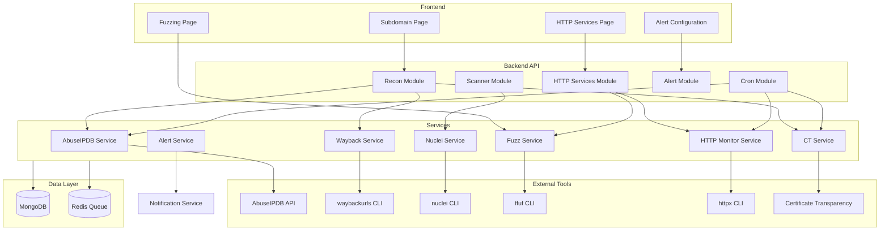

# Design Document

## Overview

The Advanced Reconnaissance and Monitoring System extends the BugBounty Watchtower platform with comprehensive external tool integrations, HTTP service monitoring with change detection, and a web-based fuzzing interface. The system follows the existing NestJS modular architecture, integrating with the current schemas and services while adding new capabilities for continuous target monitoring and alerting.

## Architecture



## Components and Interfaces

### 1. AbuseIPDB Service

```typescript
interface AbuseIPDBResult {
  ipAddress: string;
  isPublic: boolean;
  abuseConfidenceScore: number;
  countryCode: string;
  isp: string;
  domain: string;
  totalReports: number;
  lastReportedAt: Date;
  isWhitelisted: boolean;
}

interface AbuseIPDBService {
  checkIP(ip: string): Promise<AbuseIPDBResult>;
  checkIPs(ips: string[]): Promise<AbuseIPDBResult[]>;
  getReportsForIP(ip: string, maxAge?: number): Promise<AbuseReport[]>;
}
```

### 2. Wayback Service

```typescript
interface WaybackResult {
  domain: string;
  urls: string[];
  extractedDomains: string[];
  extractedEndpoints: string[];
  timestamp: Date;
}

interface WaybackService {
  fetchUrls(domain: string): Promise<WaybackResult>;
  extractDomains(urls: string[]): string[];
  extractEndpoints(urls: string[]): Endpoint[];
}
```

### 3. Nuclei Service

```typescript
interface NucleiResult {
  templateId: string;
  templateName: string;
  severity: 'info' | 'low' | 'medium' | 'high' | 'critical';
  host: string;
  matchedAt: string;
  extractedResults: string[];
  timestamp: Date;
  curl: string;
  matcher: string;
}

interface NucleiService {
  scan(targets: string[], templates?: string[]): Promise<NucleiResult[]>;
  scanSingle(target: string, templates?: string[]): Promise<NucleiResult[]>;
  getAvailableTemplates(): Promise<string[]>;
}
```

### 4. Certificate Transparency Service

```typescript
interface CTResult {
  domain: string;
  subdomains: string[];
  certificates: {
    issuer: string;
    notBefore: Date;
    notAfter: Date;
    serialNumber: string;
  }[];
}

interface CTService {
  queryDomain(domain: string): Promise<CTResult>;
  watchDomain(domain: string): void;
  stopWatching(domain: string): void;
}
```

### 5. Fuzz Service

```typescript
interface FuzzConfig {
  url: string;
  wordlist: string;
  extensions?: string[];
  matchCodes?: number[];
  filterWords?: number;
  filterLines?: number;
  filterSize?: number;
  threads?: number;
  timeout?: number;
}

interface FuzzResult {
  url: string;
  status: number;
  length: number;
  words: number;
  lines: number;
  contentType: string;
  redirectLocation?: string;
}

interface FuzzService {
  startFuzz(config: FuzzConfig): AsyncGenerator<FuzzResult>;
  stopFuzz(jobId: string): void;
  getAvailableWordlists(): Promise<string[]>;
}
```

### 6. HTTP Monitor Service

```typescript
interface HTTPMonitorConfig {
  targets: string[];
  options: {
    favicon: boolean;
    followRedirects: boolean;
    techDetect: boolean;
    includeHeaders: boolean;
    includeChain: boolean;
    timeout: number;
    retries: number;
  };
}

interface HTTPChangeEvent {
  url: string;
  changeType: 'status_code' | 'title' | 'technology' | 'favicon' | 'content';
  previousValue: any;
  currentValue: any;
  detectedAt: Date;
}

interface HTTPMonitorService {
  probe(config: HTTPMonitorConfig): Promise<HttpProbeResult[]>;
  probeSingle(url: string): Promise<HttpProbeResult>;
  detectChanges(current: HttpProbeResult, previous: HttpProbeResult): HTTPChangeEvent[];
  watchAll(): Promise<void>;
  watchFresh(): Promise<void>;
}
```

### 7. Alert Service

```typescript
interface AlertRule {
  id: string;
  name: string;
  condition: {
    type: 'status_change' | 'title_match' | 'tech_change' | 'favicon_change' | 'abuse_score';
    operator: 'equals' | 'contains' | 'regex' | 'greater_than' | 'less_than';
    value: any;
    previousValue?: any;
  };
  severity: 'info' | 'warning' | 'critical';
  channels: ('discord' | 'slack' | 'telegram' | 'email')[];
  enabled: boolean;
}

interface AlertService {
  createRule(rule: AlertRule): Promise<AlertRule>;
  updateRule(id: string, rule: Partial<AlertRule>): Promise<AlertRule>;
  deleteRule(id: string): Promise<void>;
  evaluateCondition(event: HTTPChangeEvent, rule: AlertRule): boolean;
  triggerAlert(event: HTTPChangeEvent, rule: AlertRule): Promise<void>;
}
```

## Data Models

### Alert Rule Schema

```typescript
@Schema({ timestamps: true })
export class AlertRule {
  @Prop({ required: true })
  name: string;

  @Prop({ type: Object, required: true })
  condition: {
    type: string;
    operator: string;
    value: any;
    previousValue?: any;
  };

  @Prop({ enum: ['info', 'warning', 'critical'], default: 'info' })
  severity: string;

  @Prop({ type: [String], default: [] })
  channels: string[];

  @Prop({ default: true })
  enabled: boolean;

  @Prop({ type: Types.ObjectId, ref: 'User' })
  userId: Types.ObjectId;

  @Prop({ type: Types.ObjectId, ref: 'Program' })
  programId?: Types.ObjectId;
}
```

### Fuzz Job Schema

```typescript
@Schema({ timestamps: true })
export class FuzzJob {
  @Prop({ required: true })
  url: string;

  @Prop({ required: true })
  wordlist: string;

  @Prop({ type: [String], default: [] })
  extensions: string[];

  @Prop({ type: Object })
  filters: {
    matchCodes?: number[];
    filterWords?: number;
    filterLines?: number;
    filterSize?: number;
  };

  @Prop({ enum: ['pending', 'running', 'completed', 'failed', 'cancelled'], default: 'pending' })
  status: string;

  @Prop({ type: [Object], default: [] })
  results: FuzzResult[];

  @Prop()
  startedAt: Date;

  @Prop()
  completedAt: Date;

  @Prop({ type: Types.ObjectId, ref: 'Program' })
  programId?: Types.ObjectId;

  @Prop({ type: Types.ObjectId, ref: 'User' })
  userId: Types.ObjectId;
}
```

### AbuseIPDB Result Schema

```typescript
@Schema({ timestamps: true })
export class AbuseIPDBResult {
  @Prop({ required: true })
  ipAddress: string;

  @Prop()
  abuseConfidenceScore: number;

  @Prop()
  countryCode: string;

  @Prop()
  isp: string;

  @Prop()
  domain: string;

  @Prop()
  totalReports: number;

  @Prop()
  lastReportedAt: Date;

  @Prop({ type: Types.ObjectId, ref: 'Subdomain' })
  subdomainId?: Types.ObjectId;

  @Prop({ type: Types.ObjectId, ref: 'Domain' })
  domainId?: Types.ObjectId;

  @Prop()
  checkedAt: Date;
}
```


## Correctness Properties

*A property is a characteristic or behavior that should hold true across all valid executions of a system-essentially, a formal statement about what the system should do. Properties serve as the bridge between human-readable specifications and machine-verifiable correctness guarantees.*

### Property 1: AbuseIPDB Response Parsing
*For any* valid AbuseIPDB API response, parsing the response SHALL extract and return all required fields (abuseConfidenceScore, countryCode, isp, totalReports) with correct types.
**Validates: Requirements 1.1**

### Property 2: AbuseIPDB Result Persistence
*For any* AbuseIPDB lookup result, storing the result SHALL create a database record with correct subdomain/domain association that can be retrieved.
**Validates: Requirements 1.2**

### Property 3: Abuse Score Threshold Alerting
*For any* IP with an abuse confidence score and any configured threshold, an alert SHALL be triggered if and only if the score exceeds the threshold.
**Validates: Requirements 1.3**

### Property 4: Domain Extraction from URLs
*For any* list of URLs, extracting domains SHALL return a set of unique, valid domain names with no duplicates.
**Validates: Requirements 2.2**

### Property 5: Wayback Discovery Storage
*For any* domains or endpoints discovered from Waybackurls, storing them SHALL create records with source attribution set to "waybackurls" and correct parent domain association.
**Validates: Requirements 2.3, 2.4**

### Property 6: Nuclei Command Construction
*For any* target list and template selection, the constructed Nuclei command SHALL include all specified targets and templates with correct syntax.
**Validates: Requirements 3.1**

### Property 7: Nuclei Result Parsing
*For any* valid Nuclei JSON output, parsing SHALL extract severity, templateId, host, and matchedAt fields correctly for each finding.
**Validates: Requirements 3.2**

### Property 8: Severity-Based Alerting
*For any* vulnerability finding, an immediate alert SHALL be triggered if and only if severity equals "critical" or "high".
**Validates: Requirements 3.3**

### Property 9: Certificate SAN Extraction
*For any* certificate with Subject Alternative Names, extraction SHALL return all valid subdomains from the SAN field.
**Validates: Requirements 4.2**

### Property 10: CT Discovery Attribution
*For any* subdomain discovered via Certificate Transparency, storing it SHALL set the source field to "cert_trans".
**Validates: Requirements 4.3**

### Property 11: Live Subdomain Filtering
*For any* collection of subdomains with mixed isAlive values, filtering for live subdomains SHALL return exactly those where isAlive equals true.
**Validates: Requirements 5.2**

### Property 12: HTTPx Command Options
*For any* single domain probe request, the constructed httpx command SHALL include favicon, tech-detect, headers, redirect chain, timeout=5, and retries=3 flags.
**Validates: Requirements 6.1, 6.4**

### Property 13: HTTP Probe Result Storage
*For any* HTTP probe result, storing it SHALL persist all metadata fields (faviconHash, headers, technologies, statusCode, title) retrievably.
**Validates: Requirements 6.2**

### Property 14: HTTPx JSON Parsing
*For any* valid httpx JSON output line, parsing SHALL produce a structured HttpProbeResult with all fields correctly mapped.
**Validates: Requirements 6.3**

### Property 15: FFUF Command Construction
*For any* FuzzConfig with URL, wordlist, extensions, and filters, the constructed ffuf command SHALL include all specified parameters with correct syntax.
**Validates: Requirements 7.2**

### Property 16: Fuzz Result Storage
*For any* completed fuzzing job with results, storing SHALL associate all results with the correct target domain.
**Validates: Requirements 7.5**

### Property 17: HTTP Change Detection
*For any* pair of HTTP scan results (previous and current) for the same URL, change detection SHALL correctly identify differences in statusCode, title, technologies, and faviconHash, setting appropriate change flags.
**Validates: Requirements 8.1, 8.2, 8.3, 8.4, 8.5**

### Property 18: Previous Scan Preservation
*For any* HTTP service update with new scan data, the previous scan data SHALL be preserved in the previousScan field before updating current values.
**Validates: Requirements 8.6**

### Property 19: HTTP Service Filtering
*For any* collection of HTTP services and filter criteria (statusCode, technology, isCdn, isFresh, change flags), filtering SHALL return exactly the services matching all specified criteria.
**Validates: Requirements 9.1, 9.2, 9.4**

### Property 20: Header Regex Matching
*For any* HTTP service with headers and a regex pattern, header search SHALL return the service if and only if any header value matches the pattern.
**Validates: Requirements 9.3**

### Property 21: Alert Rule Condition Evaluation
*For any* alert rule with a condition and any HTTP change event, condition evaluation SHALL return true if and only if the event matches the rule's condition type, operator, and value.
**Validates: Requirements 10.1, 10.2**

### Property 22: Multi-Channel Alert Delivery
*For any* triggered alert with configured channels, the notification service SHALL attempt delivery to all specified channels.
**Validates: Requirements 10.3**

## Error Handling

### External Tool Failures
- CLI tool execution failures (waybackurls, nuclei, ffuf, httpx) SHALL be caught and logged with appropriate error messages
- Timeout errors SHALL trigger retry logic up to the configured retry count
- Tool not found errors SHALL return a clear error message indicating the missing dependency

### API Failures
- AbuseIPDB API rate limiting SHALL be handled with exponential backoff
- Certificate Transparency API failures SHALL be logged and the operation retried
- Network timeouts SHALL not crash the service; partial results SHALL be returned where possible

### Data Validation
- Invalid IP addresses SHALL be rejected before AbuseIPDB lookup
- Malformed URLs SHALL be rejected before fuzzing
- Invalid regex patterns in header search SHALL return a validation error

### Change Detection Edge Cases
- First scan of a service (no previous data) SHALL not trigger change alerts
- Services with null/undefined fields SHALL be handled gracefully in comparisons
- Empty technology arrays SHALL be treated as "no technologies detected"

## Testing Strategy

### Unit Testing
Unit tests will cover:
- Individual service method logic
- Data transformation and parsing functions
- Validation logic for inputs
- Error handling paths

### Property-Based Testing
Property-based tests will use **fast-check** library for TypeScript to verify:
- All 22 correctness properties defined above
- Each property test SHALL run a minimum of 100 iterations
- Each property test SHALL be tagged with format: `**Feature: advanced-recon-monitoring, Property {number}: {property_text}**`

### Test Organization
- Property tests SHALL be co-located with the service they test using `.property.spec.ts` suffix
- Unit tests SHALL use `.spec.ts` suffix
- Integration tests SHALL use `.integration.spec.ts` suffix

### Generators
Custom generators will be created for:
- Valid IP addresses (IPv4 and IPv6)
- Valid URLs with various schemes and paths
- HTTP probe results with realistic field values
- Nuclei JSON output format
- HTTPx JSON output format
- Alert rules with various condition types
- FuzzConfig objects with valid parameters
