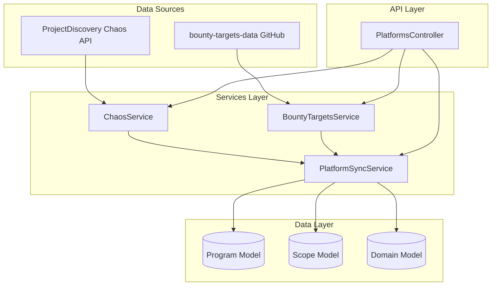

# Design Document: Bounty Data Sources Integration

## Overview

This design extends the existing platform sync architecture to integrate two additional bug bounty data sources: ProjectDiscovery Chaos API and the bounty-targets-data GitHub repository. The implementation follows the established patterns in the codebase, adding new service classes that conform to the existing sync orchestration model.

The design prioritizes:
- Fast, efficient data fetching using pre-aggregated data sources
- Minimal API calls through bulk data retrieval
- Seamless integration with existing program/scope/domain data models
- Robust error handling with retry logic

## Architecture



## Components and Interfaces

### ChaosService

New service class for interacting with ProjectDiscovery Chaos API.

```typescript
interface ChaosProgram {
  name: string;
  url: string;
  bounty: boolean;
  swag: boolean;
  domains: string[];
  subdomainCount: number;
  lastUpdated: string;
  platform: string;
}

interface ChaosIndexEntry {
  name: string;
  url: string;
  bounty: boolean;
  swag: boolean;
  count: number;
  change: number;
  is_new: boolean;
  platform: string;
  last_updated: string;
}

class ChaosService {
  // Fetch the program index from Chaos API
  async fetchProgramIndex(): Promise<ChaosIndexEntry[]>;
  
  // Transform Chaos data to internal program format
  transformToProgram(entry: ChaosIndexEntry): ChaosProgram;
  
  // Generate a normalized handle from program name
  normalizeHandle(name: string): string;
  
  // Fetch all programs with their metadata
  async getPrograms(): Promise<ChaosProgram[]>;
}
```

### BountyTargetsService

New service class for fetching data from bounty-targets-data repository.

```typescript
interface BountyTargetsProgram {
  name: string;
  handle: string;
  url: string;
  platform: string;
  offersBounties: boolean;
  maxBounty: number | null;
  inScope: BountyTargetsScope[];
  outOfScope: BountyTargetsScope[];
}

interface BountyTargetsScope {
  type: string;
  target: string;
  instruction?: string;
  eligibleForBounty?: boolean;
}

interface PlatformDataFile {
  platform: string;
  filename: string;
  transformer: (data: any) => BountyTargetsProgram[];
}

class BountyTargetsService {
  // Fetch and parse a specific platform's data file
  async fetchPlatformData(platform: string): Promise<BountyTargetsProgram[]>;
  
  // Fetch all platform data files
  async getAllPrograms(): Promise<BountyTargetsProgram[]>;
  
  // Transform HackerOne format to internal format
  transformHackerOneData(data: any[]): BountyTargetsProgram[];
  
  // Transform Bugcrowd format to internal format
  transformBugcrowdData(data: any[]): BountyTargetsProgram[];
  
  // Transform Intigriti format to internal format
  transformIntigritiData(data: any[]): BountyTargetsProgram[];
  
  // Transform YesWeHack format to internal format
  transformYesWeHackData(data: any[]): BountyTargetsProgram[];
  
  // Transform Federacy format to internal format
  transformFederacyData(data: any[]): BountyTargetsProgram[];
}
```

### Extended PlatformSyncService

Extensions to the existing sync service.

```typescript
// New methods added to PlatformSyncService
class PlatformSyncService {
  // Existing methods...
  
  // Sync programs from Chaos API
  async syncChaos(log?: LogFn): Promise<SyncResult>;
  
  // Sync programs from bounty-targets-data
  async syncBountyTargets(log?: LogFn): Promise<SyncResult>;
  
  // Upsert a Chaos program
  private async upsertChaosProgram(
    program: ChaosProgram
  ): Promise<{ isNew: boolean; programId: Types.ObjectId }>;
  
  // Upsert a bounty-targets program
  private async upsertBountyTargetsProgram(
    program: BountyTargetsProgram
  ): Promise<{ isNew: boolean; programId: Types.ObjectId }>;
  
  // Sync scopes from bounty-targets data
  private async syncBountyTargetsScopes(
    programId: Types.ObjectId,
    program: BountyTargetsProgram
  ): Promise<number>;
}
```

### Extended PlatformsController

New API endpoints.

```typescript
// New endpoints added to PlatformsController
@Post('sync/chaos')
async syncChaos(): Promise<SyncResult>;

@Post('sync/bounty-targets')
async syncBountyTargets(): Promise<SyncResult>;

@Get('chaos/programs')
async getChaosPrograms(): Promise<ChaosProgram[]>;

@Get('bounty-targets/programs')
async getBountyTargetsPrograms(): Promise<BountyTargetsProgram[]>;
```

## Data Models

### Chaos Data Source Schema

The Chaos API returns data in this format:

```json
{
  "name": "Example Corp",
  "url": "https://example.com",
  "bounty": true,
  "swag": false,
  "count": 1234,
  "change": 5,
  "is_new": false,
  "platform": "hackerone",
  "last_updated": "2024-01-15"
}
```

### Bounty-Targets Data Formats

HackerOne format from bounty-targets-data:
```json
{
  "id": "12345",
  "handle": "example",
  "name": "Example Corp",
  "url": "https://hackerone.com/example",
  "offers_bounties": true,
  "offers_swag": false,
  "targets": {
    "in_scope": [
      {
        "asset_type": "URL",
        "asset_identifier": "*.example.com",
        "eligible_for_bounty": true,
        "instruction": "Main application"
      }
    ],
    "out_of_scope": [
      {
        "asset_type": "URL", 
        "asset_identifier": "blog.example.com",
        "instruction": "Blog is out of scope"
      }
    ]
  }
}
```

Intigriti format:
```json
{
  "company_handle": "example",
  "name": "Example Corp",
  "url": "https://app.intigriti.com/programs/example",
  "max_bounty": 5000,
  "min_bounty": 100,
  "targets": {
    "in_scope": [
      {
        "type": "url",
        "endpoint": "*.example.com"
      }
    ]
  }
}
```

### Program Storage Mapping

| Source Field | Program Schema Field |
|--------------|---------------------|
| name | name |
| handle/code/company_handle | handle |
| url | url |
| platform | platform |
| bounty/offers_bounties | offersBounties |
| max_bounty | bountyRange.max |
| min_bounty | bountyRange.min |
| count (Chaos) | subdomainCount |
| last_updated | lastSyncedAt |

## Correctness Properties

*A property is a characteristic or behavior that should hold true across all valid executions of a system-essentially, a formal statement about what the system should do. Properties serve as the bridge between human-readable specifications and machine-verifiable correctness guarantees.*


### Property 1: Handle Normalization Consistency

*For any* program name string, normalizing it to a handle should produce a lowercase, hyphen-separated string with no special characters, and normalizing the same name twice should produce identical results.

**Validates: Requirements 1.4**

### Property 2: Data Transformation Preserves Source Information

*For any* valid source data (Chaos entry or bounty-targets program), transforming it to the internal format should preserve all essential fields: name, URL, bounty status, and scope targets should be extractable from the transformed result.

**Validates: Requirements 1.2, 2.7, 3.6**

### Property 3: Domain Extraction from Targets

*For any* scope target that is a wildcard (*.domain.com) or URL (https://domain.com/path), extracting the domain should produce a valid domain string without protocol, path, or wildcard prefix.

**Validates: Requirements 3.2, 3.3**

### Property 4: Error Isolation Continues Processing

*For any* list of programs where some programs cause errors during processing, the sync operation should successfully process all non-erroring programs and the failure count should equal the number of erroring programs.

**Validates: Requirements 6.2, 6.4**

### Property 5: Upsert Preserves Uniqueness and Timestamps

*For any* program synced multiple times, there should be exactly one record with matching platform+handle, and the firstSyncedAt timestamp should remain unchanged from the first sync while lastSyncedAt should be updated.

**Validates: Requirements 7.1, 7.3, 7.4**

### Property 6: Sync Result Accuracy

*For any* sync operation, the Sync_Result should accurately reflect: newPrograms + updatedPrograms equals total programs processed, successCount + failureCount equals total programs attempted, and duration should be positive.

**Validates: Requirements 4.5, 6.3**

### Property 7: Exponential Backoff Delay Calculation

*For any* retry attempt number n (0-indexed), the calculated backoff delay should equal baseDelay * 2^n, capped at maxDelay.

**Validates: Requirements 6.1**

### Property 8: API Error Returns Empty Result

*For any* API error (network failure, invalid response, rate limit exhaustion), the service should return an empty program list rather than throwing an exception.

**Validates: Requirements 1.5, 2.8**

## Error Handling

### Network Errors

- **Connection failures**: Catch and log, return empty result
- **Timeout errors**: Use 30-second timeout, retry once, then return empty
- **Invalid JSON**: Log parsing error, return empty result for that source

### Rate Limiting

- **429 responses**: Implement exponential backoff with delays: 1s, 2s, 4s, 8s
- **Max retries**: 3 retries before giving up on that request
- **Retry-After header**: Honor if present, otherwise use calculated backoff

### Data Validation Errors

- **Missing required fields**: Skip program, log warning, continue with others
- **Invalid URL format**: Store as-is, let downstream validation handle
- **Malformed scope data**: Skip scope entry, continue with valid entries

### Per-Program Error Isolation

```typescript
for (const program of programs) {
  try {
    await this.processProgram(program);
    result.successCount++;
  } catch (error) {
    result.failureCount++;
    result.errors.push(`${program.handle}: ${error.message}`);
    // Continue with remaining programs
  }
}
```

## Testing Strategy

### Unit Tests

Unit tests verify specific examples and edge cases:

1. **ChaosService**
   - Test fetchProgramIndex with mocked HTTP response
   - Test normalizeHandle with various input strings
   - Test error handling when API returns 500

2. **BountyTargetsService**
   - Test each platform transformer with sample data
   - Test scope extraction for in-scope and out-of-scope
   - Test handling of missing optional fields

3. **PlatformSyncService**
   - Test upsert creates new program when none exists
   - Test upsert updates existing program
   - Test domain extraction from various target formats

### Property-Based Tests

Property-based tests verify universal properties across many generated inputs. Each property test should run minimum 100 iterations.

**Testing Framework**: fast-check (already used in the codebase)

1. **Property 1 Test**: Generate random strings, verify normalization produces valid handles
2. **Property 2 Test**: Generate random valid source data, verify transformation preserves fields
3. **Property 3 Test**: Generate random URLs and wildcards, verify domain extraction
4. **Property 4 Test**: Generate program lists with random errors, verify isolation
5. **Property 5 Test**: Simulate multiple syncs, verify uniqueness and timestamp preservation
6. **Property 6 Test**: Generate sync scenarios, verify result accuracy
7. **Property 7 Test**: Generate retry attempt numbers, verify backoff calculation
8. **Property 8 Test**: Simulate various API errors, verify empty result returned

### Integration Tests

- Test full sync flow with mocked external APIs
- Test database operations (create, update, deduplication)
- Test API endpoints with authentication

## Implementation Notes

### Data Source URLs

```typescript
const CHAOS_INDEX_URL = 'https://chaos-data.projectdiscovery.io/index.json';

const BOUNTY_TARGETS_BASE_URL = 'https://raw.githubusercontent.com/arkadiyt/bounty-targets-data/main/data/';

const BOUNTY_TARGETS_FILES = [
  'hackerone_data.json',
  'bugcrowd_data.json',
  'intigriti_data.json',
  'yeswehack_data.json',
  'federacy_data.json',
];
```

### Platform Mapping

| Source | Platform Value |
|--------|---------------|
| Chaos (HackerOne) | hackerone |
| Chaos (Bugcrowd) | bugcrowd |
| Chaos (other) | chaos |
| bounty-targets HackerOne | hackerone |
| bounty-targets Bugcrowd | bugcrowd |
| bounty-targets Intigriti | intigriti |
| bounty-targets YesWeHack | yeswehack |
| bounty-targets Federacy | federacy |

### Deduplication Strategy

1. Direct API syncs (HackerOne, Bugcrowd) run first
2. Chaos sync runs second, skips programs already synced from direct APIs
3. Bounty-targets sync runs last, only adds programs not already present
4. Use `findOneAndUpdate` with `upsert: true` for atomic operations
