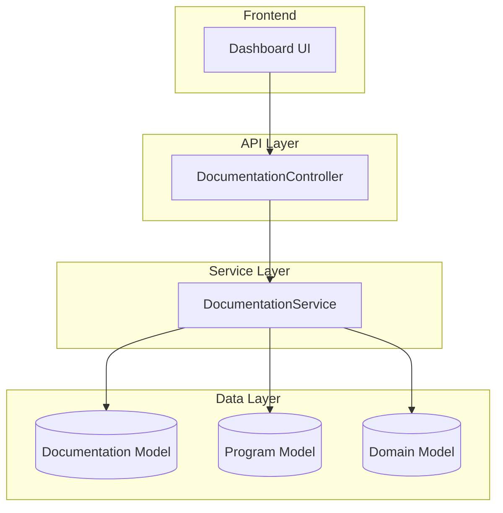

# Design Document: Documentation System

## Overview

This feature implements the Documentation System for the BugBounty Watchtower platform, enabling bug bounty hunters to store personal learning notes, build a technique library, and map which documentation covers which targets. The schema already exists (`documentation.schema.ts`) with comprehensive fields including title, content, type, tags, categories, targets, technologies, vulnerability types, coverage mapping, and related documents.

This design adds:
1. A DocumentationService for business logic and database operations
2. A DocumentationController for REST API endpoints
3. A DocumentationModule to wire everything together
4. DTOs for request/response validation

## Architecture



## Components and Interfaces

### 1. DocumentationService

The service handles all business logic for documentation management.

```typescript
export interface DocumentationFilter {
  type?: DocType;
  tags?: string[];
  categories?: string[];
  targets?: string[];
  technologies?: string[];
  vulnerabilityTypes?: string[];
  createdBy?: string;
  isPinned?: boolean;
  isPublic?: boolean;
  search?: string;
  limit?: number;
  offset?: number;
  sort?: string;
}

export interface CoverageResult {
  target: string;
  coverage: {
    docId: string;
    title: string;
    type: DocType;
    relevanceScore: number;
    sections: string[];
    tags: string[];
  }[];
}

@Injectable()
export class DocumentationService {
  // CRUD operations
  async create(data: CreateDocumentationDto, userId?: string): Promise<DocumentationDocument>;
  async findById(id: string, incrementView?: boolean): Promise<DocumentationDocument>;
  async findAll(filter: DocumentationFilter): Promise<DocumentationDocument[]>;
  async update(id: string, data: UpdateDocumentationDto, userId?: string): Promise<DocumentationDocument>;
  async delete(id: string): Promise<void>;
  
  // Search and filtering
  async search(query: string, filter?: DocumentationFilter): Promise<DocumentationDocument[]>;
  async findByTag(tag: string, filter?: DocumentationFilter): Promise<DocumentationDocument[]>;
  async findByTechnology(tech: string, filter?: DocumentationFilter): Promise<DocumentationDocument[]>;
  async findByType(type: DocType, filter?: DocumentationFilter): Promise<DocumentationDocument[]>;
  
  // Coverage operations
  async getCoverageForTarget(target: string): Promise<CoverageResult>;
  async addCoverage(docId: string, coverage: CoverageEntry): Promise<DocumentationDocument>;
  async removeCoverage(docId: string, targetId: string): Promise<DocumentationDocument>;
  
  // Pin operations
  async pin(id: string): Promise<DocumentationDocument>;
  async unpin(id: string): Promise<DocumentationDocument>;
  
  // Related docs
  async addRelatedDoc(id: string, relatedId: string): Promise<DocumentationDocument>;
  async removeRelatedDoc(id: string, relatedId: string): Promise<DocumentationDocument>;
  
  // Stats
  async count(filter?: DocumentationFilter): Promise<number>;
  async getStats(): Promise<DocumentationStats>;
}
```

### 2. DocumentationController

REST API endpoints following NestJS conventions.

```typescript
@Controller('docs')
export class DocumentationController {
  @Get()
  async findAll(@Query() filter: DocumentationFilterDto): Promise<DocumentationDocument[]>;
  
  @Get('search')
  async search(@Query('q') query: string, @Query() filter: DocumentationFilterDto): Promise<DocumentationDocument[]>;
  
  @Get('coverage/:target')
  async getCoverage(@Param('target') target: string): Promise<CoverageResult>;
  
  @Get('stats')
  async getStats(): Promise<DocumentationStats>;
  
  @Get(':id')
  async findOne(@Param('id') id: string): Promise<DocumentationDocument>;
  
  @Post()
  async create(@Body() data: CreateDocumentationDto, @Request() req): Promise<DocumentationDocument>;
  
  @Put(':id')
  async update(@Param('id') id: string, @Body() data: UpdateDocumentationDto, @Request() req): Promise<DocumentationDocument>;
  
  @Delete(':id')
  async delete(@Param('id') id: string): Promise<void>;
  
  @Post(':id/pin')
  async pin(@Param('id') id: string): Promise<DocumentationDocument>;
  
  @Delete(':id/pin')
  async unpin(@Param('id') id: string): Promise<DocumentationDocument>;
  
  @Post(':id/related/:relatedId')
  async addRelated(@Param('id') id: string, @Param('relatedId') relatedId: string): Promise<DocumentationDocument>;
  
  @Delete(':id/related/:relatedId')
  async removeRelated(@Param('id') id: string, @Param('relatedId') relatedId: string): Promise<DocumentationDocument>;
}
```

### 3. DTOs

```typescript
export class CreateDocumentationDto {
  @IsString()
  @IsNotEmpty()
  title: string;

  @IsString()
  @IsNotEmpty()
  content: string;

  @IsEnum(DocType)
  @IsOptional()
  type?: DocType;

  @IsArray()
  @IsString({ each: true })
  @IsOptional()
  tags?: string[];

  @IsArray()
  @IsString({ each: true })
  @IsOptional()
  categories?: string[];

  @IsArray()
  @IsString({ each: true })
  @IsOptional()
  targets?: string[];

  @IsArray()
  @IsString({ each: true })
  @IsOptional()
  technologies?: string[];

  @IsArray()
  @IsString({ each: true })
  @IsOptional()
  vulnerabilityTypes?: string[];

  @IsBoolean()
  @IsOptional()
  isPublic?: boolean;

  @IsArray()
  @IsOptional()
  relatedDocs?: string[];
}

export class UpdateDocumentationDto extends PartialType(CreateDocumentationDto) {}

export class DocumentationFilterDto {
  @IsEnum(DocType)
  @IsOptional()
  type?: DocType;

  @IsString()
  @IsOptional()
  tag?: string;

  @IsString()
  @IsOptional()
  category?: string;

  @IsString()
  @IsOptional()
  target?: string;

  @IsString()
  @IsOptional()
  technology?: string;

  @IsBoolean()
  @IsOptional()
  @Transform(({ value }) => value === 'true')
  isPinned?: boolean;

  @IsNumber()
  @IsOptional()
  @Transform(({ value }) => parseInt(value))
  limit?: number;

  @IsNumber()
  @IsOptional()
  @Transform(({ value }) => parseInt(value))
  offset?: number;

  @IsString()
  @IsOptional()
  sort?: string;
}
```

## Data Models

The existing Documentation schema is used. Key fields:

| Field | Type | Description |
|-------|------|-------------|
| title | string | Document title (required) |
| content | string | Document content (required) |
| type | DocType | note, technique, writeup, reference, checklist |
| tags | string[] | Searchable tags |
| categories | string[] | Category groupings |
| targets | string[] | Target names this doc covers |
| technologies | string[] | Related technologies |
| vulnerabilityTypes | string[] | Vulnerability types covered |
| coverage | object[] | Detailed coverage mapping with relevance scores |
| createdBy | ObjectId | User who created the doc |
| isPinned | boolean | Whether doc is pinned |
| viewCount | number | Number of views |
| relatedDocs | ObjectId[] | Related documentation IDs |
| lastAccessedAt | Date | Last view timestamp |

## Correctness Properties

*A property is a characteristic or behavior that should hold true across all valid executions of a system-essentially, a formal statement about what the system should do. Properties serve as the bridge between human-readable specifications and machine-verifiable correctness guarantees.*

### Property 1: Create-Read Round Trip

*For any* valid documentation data (title, content, type, tags, categories, targets, technologies), creating a document and then reading it by ID SHALL return a document with equivalent field values.

**Validates: Requirements 1.1, 1.4**

### Property 2: Update Preserves Unchanged Fields

*For any* existing document and any partial update containing a subset of fields, after the update, the document SHALL have the new values for updated fields AND the original values for fields not included in the update.

**Validates: Requirements 1.2**

### Property 3: Delete Removes Document

*For any* existing document, after deletion, querying for that document by ID SHALL return not found.

**Validates: Requirements 1.3**

### Property 4: List Sorting by Date

*For any* set of documents returned by findAll without explicit sort, the documents SHALL be ordered by createdAt descending (newest first).

**Validates: Requirements 1.5**

### Property 5: Tag Search Returns Matching Documents

*For any* tag value and set of documents, searching by that tag SHALL return exactly the documents that contain that tag in their tags array.

**Validates: Requirements 2.1, 2.3**

### Property 6: Type Filter Returns Correct Type

*For any* document type filter, all documents returned by findByType SHALL have that exact type value.

**Validates: Requirements 2.4**

### Property 7: Text Search Across Fields

*For any* search term that appears in a document's title, content, or tags, that document SHALL be included in the search results.

**Validates: Requirements 2.5**

### Property 8: Coverage Query Returns Target Documents

*For any* target name, getCoverageForTarget SHALL return all documents that have that target in their targets array or coverage array.

**Validates: Requirements 3.3**

### Property 9: Technology Filter Returns Matching Documents

*For any* technology value, findByTechnology SHALL return exactly the documents that contain that technology in their technologies array.

**Validates: Requirements 3.5**

### Property 10: Pagination Correctness

*For any* limit and offset values, findAll SHALL return at most `limit` documents starting from position `offset` in the sorted result set.

**Validates: Requirements 4.1**

### Property 11: Pin Toggle Correctness

*For any* document, calling pin() SHALL set isPinned to true, and calling unpin() SHALL set isPinned to false.

**Validates: Requirements 5.1, 5.2**

### Property 12: Pinned Documents Sort First

*For any* list of documents with mixed pinned status, when sorted by default order, all pinned documents SHALL appear before all non-pinned documents.

**Validates: Requirements 5.3**

### Property 13: View Increments Count and Timestamp

*For any* document with initial viewCount N, after calling findById with incrementView=true, the viewCount SHALL be N+1 and lastAccessedAt SHALL be updated to a recent timestamp.

**Validates: Requirements 5.4**

### Property 14: Related Docs Populated on Fetch

*For any* document with relatedDocs containing valid document IDs, fetching that document SHALL include populated related document data (at minimum: _id, title, type).

**Validates: Requirements 6.2**

### Property 15: Deleted Doc Removed from Related Refs

*For any* document A that has document B in its relatedDocs, after deleting document B, document A's relatedDocs SHALL no longer contain B's ID.

**Validates: Requirements 6.3**

## Error Handling

| Error Type | HTTP Status | Handling Strategy |
|------------|-------------|-------------------|
| Document not found | 404 | Throw NotFoundException |
| Invalid ObjectId | 400 | Throw BadRequestException |
| Validation error | 400 | Return validation errors via class-validator |
| Duplicate title (if enforced) | 409 | Throw ConflictException |
| Database error | 500 | Log error, throw InternalServerErrorException |

## Testing Strategy

### Dual Testing Approach

This feature requires both unit tests and property-based tests:

1. **Unit Tests**: Verify specific examples, edge cases, and error conditions
2. **Property-Based Tests**: Verify universal properties across all valid inputs

### Property-Based Testing Framework

The project uses **fast-check** for property-based testing in TypeScript/JavaScript.

### Test Categories

#### 1. CRUD Property Tests

- Generate random valid documentation data
- Verify create-read round trip
- Verify update preserves unchanged fields
- Verify delete removes document

#### 2. Search and Filter Property Tests

- Generate documents with various tags/types/technologies
- Verify filters return correct subsets
- Verify text search finds matching documents

#### 3. Sorting and Pagination Property Tests

- Generate multiple documents
- Verify sort order invariants
- Verify pagination boundaries

#### 4. Pin and View Property Tests

- Verify pin/unpin toggle behavior
- Verify view count increment
- Verify pinned sort order

#### 5. Related Docs Property Tests

- Verify population on fetch
- Verify cleanup on delete

### Test Annotations

Each property-based test MUST be tagged with:
```typescript
// **Feature: documentation-system, Property {number}: {property_text}**
```

### Minimum Iterations

Property-based tests MUST run a minimum of 100 iterations to ensure adequate coverage.
