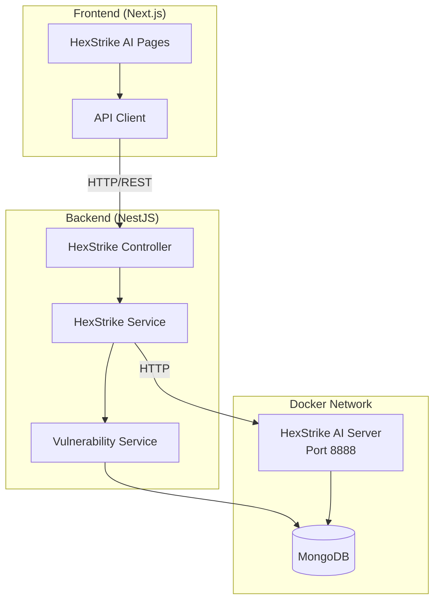

# Design Document: HexStrike AI Integration

## Overview

This design document describes the architecture and implementation details for integrating HexStrike AI v6.0 into the Bug Bounty platform. The integration consists of three main components:

1. **Docker Container** - HexStrike AI server running as a containerized service
2. **Backend API Proxy** - NestJS module that proxies requests to HexStrike AI
3. **Frontend UI** - Next.js pages and components for interacting with HexStrike AI

The integration enables security researchers to leverage AI-powered penetration testing capabilities, including intelligent target analysis, automated tool selection, and comprehensive security assessments through a web interface.

## Architecture



## Components and Interfaces

### 1. Docker Configuration

The HexStrike AI container will be added to `docker-compose.dev.yml`:

```yaml
hexstrike-ai:
  build:
    context: ./hexstrike-ai
    dockerfile: Dockerfile
  container_name: bb-hexstrike-ai
  restart: unless-stopped
  environment:
    HEXSTRIKE_PORT: 8888
    HEXSTRIKE_HOST: 0.0.0.0
  ports:
    - "8888:8888"
  volumes:
    - hexstrike_results:/app/results
    - hexstrike_logs:/app/logs
  healthcheck:
    test: ["CMD", "curl", "-f", "http://localhost:8888/health"]
    interval: 30s
    timeout: 10s
    retries: 3
    start_period: 60s
  networks:
    - bb-network
```

### 2. Backend Module Structure

```
backend/src/modules/hexstrike/
├── hexstrike.module.ts
├── hexstrike.controller.ts
├── hexstrike.service.ts
├── dto/
│   ├── analyze-target.dto.ts
│   ├── execute-tool.dto.ts
│   ├── workflow.dto.ts
│   └── process.dto.ts
└── interfaces/
    └── hexstrike.interface.ts
```

### 3. Backend API Endpoints

| Endpoint | Method | Description |
|----------|--------|-------------|
| `/api/v1/hexstrike/health` | GET | Get HexStrike AI server health status |
| `/api/v1/hexstrike/analyze-target` | POST | Analyze target and get profile |
| `/api/v1/hexstrike/tools` | GET | List available security tools |
| `/api/v1/hexstrike/tools/:tool/execute` | POST | Execute a specific tool |
| `/api/v1/hexstrike/workflows` | GET | List available AI workflows |
| `/api/v1/hexstrike/workflows/:type/start` | POST | Start an AI workflow |
| `/api/v1/hexstrike/processes` | GET | List active processes |
| `/api/v1/hexstrike/processes/:pid` | GET | Get process status |
| `/api/v1/hexstrike/processes/:pid/terminate` | POST | Terminate a process |

### 4. Frontend Page Structure

```
frontend/src/app/dashboard/hexstrike/
├── page.tsx                    # Main HexStrike AI dashboard
├── analyze/
│   └── page.tsx               # Target analysis page
├── tools/
│   ├── page.tsx               # Tools listing page
│   └── [tool]/
│       └── page.tsx           # Tool execution page
├── workflows/
│   ├── page.tsx               # Workflows listing page
│   └── [type]/
│       └── page.tsx           # Workflow execution page
├── processes/
│   └── page.tsx               # Process monitoring dashboard
└── settings/
    └── page.tsx               # HexStrike AI settings
```

## Data Models

### TargetProfile Interface

```typescript
interface TargetProfile {
  target: string;
  targetType: 'web_application' | 'network_host' | 'api_endpoint' | 'cloud_service' | 'binary_file' | 'unknown';
  ipAddresses: string[];
  openPorts: number[];
  services: Record<number, string>;
  technologies: string[];
  cmsType?: string;
  cloudProvider?: string;
  securityHeaders: Record<string, string>;
  sslInfo: Record<string, any>;
  subdomains: string[];
  endpoints: string[];
  attackSurfaceScore: number;
  riskLevel: 'critical' | 'high' | 'medium' | 'low' | 'minimal' | 'unknown';
  confidenceScore: number;
}
```

### SecurityTool Interface

```typescript
interface SecurityTool {
  name: string;
  displayName: string;
  category: 'network' | 'web' | 'cloud' | 'binary' | 'ctf' | 'osint';
  description: string;
  parameters: ToolParameter[];
  effectiveness: Record<string, number>;
  isInstalled: boolean;
}

interface ToolParameter {
  name: string;
  type: 'string' | 'number' | 'boolean' | 'array';
  description: string;
  required: boolean;
  default?: any;
}
```

### ToolExecution Interface

```typescript
interface ToolExecution {
  id: string;
  tool: string;
  target: string;
  parameters: Record<string, any>;
  status: 'pending' | 'running' | 'completed' | 'failed' | 'cancelled';
  startTime: Date;
  endTime?: Date;
  output?: string;
  results?: any;
  error?: string;
  pid?: number;
}
```

### AIWorkflow Interface

```typescript
interface AIWorkflow {
  type: 'bugbounty' | 'ctf' | 'reconnaissance' | 'vulnerability-hunting' | 'osint';
  name: string;
  description: string;
  steps: WorkflowStep[];
  estimatedTime: number;
  requiredTools: string[];
}

interface WorkflowStep {
  tool: string;
  parameters: Record<string, any>;
  expectedOutcome: string;
  successProbability: number;
  executionTimeEstimate: number;
  dependencies: string[];
}
```

### HexStrikeVulnerability Interface

```typescript
interface HexStrikeVulnerability {
  name: string;
  severity: 'critical' | 'high' | 'medium' | 'low' | 'info';
  description: string;
  target: string;
  tool: string;
  evidence?: string;
  remediation?: string;
  cvss?: number;
  cve?: string;
  discoveredAt: Date;
}
```

## Correctness Properties

*A property is a characteristic or behavior that should hold true across all valid executions of a system-essentially, a formal statement about what the system should do. Properties serve as the bridge between human-readable specifications and machine-verifiable correctness guarantees.*


### Property 1: API Authentication Enforcement

*For any* request to a HexStrike AI endpoint (under `/api/v1/hexstrike/*`), if the request does not include a valid authentication token, the Backend_API shall return a 401 Unauthorized response.

**Validates: Requirements 2.6**

### Property 2: Target Analysis Response Structure

*For any* valid target string submitted to the `/hexstrike/analyze-target` endpoint, the Backend_API shall return a response containing all required Target_Profile fields: target, targetType, ipAddresses, openPorts, services, technologies, attackSurfaceScore, riskLevel, and confidenceScore.

**Validates: Requirements 2.3**

### Property 3: Tool Execution Response Structure

*For any* valid tool execution request with a recognized tool name and valid parameters, the Backend_API shall return a response containing: id, tool, target, status, and either output/results (on success) or error (on failure).

**Validates: Requirements 2.5**

### Property 4: Target Profile UI Rendering

*For any* Target_Profile object returned from analysis, the Frontend_UI shall render all non-empty fields including: IP addresses list, open ports list, detected technologies, attack surface score, and risk level indicator.

**Validates: Requirements 3.3**

### Property 5: Tool Results UI Rendering

*For any* completed tool execution with results, the Frontend_UI shall render the results in a structured format appropriate to the tool type, with all output data accessible to the user.

**Validates: Requirements 4.4**

### Property 6: Severity Color Mapping Consistency

*For any* severity level (critical, high, medium, low, info), both the Backend_API severity mapping and Frontend_UI color coding shall produce consistent visual representations: critical=red, high=orange, medium=yellow, low=blue, info=gray.

**Validates: Requirements 4.6, 7.2**

### Property 7: Workflow Report Generation

*For any* completed AI_Agent workflow, the Frontend_UI shall generate and display a report containing: workflow type, execution duration, steps completed, findings discovered, and recommendations.

**Validates: Requirements 5.5**

### Property 8: Process Status Display Completeness

*For any* running process in the HexStrike AI system, the Frontend_UI dashboard shall display: process ID, status (running/completed/failed), command being executed, and elapsed duration.

**Validates: Requirements 6.2**

### Property 9: Vulnerability Storage with Associations

*For any* vulnerability discovered by a HexStrike AI tool, the Backend_API shall store it in the database with: name, severity, description, target, source tool, and associations to the relevant program and domain (if identifiable from the target).

**Validates: Requirements 7.1, 7.3**

### Property 10: Configuration Persistence Round-Trip

*For any* HexStrike AI configuration object saved through the settings API, retrieving the configuration shall return an equivalent object with all fields preserved.

**Validates: Requirements 8.3**

## Error Handling

### Backend Error Handling

1. **HexStrike AI Server Unavailable**
   - Return 503 Service Unavailable with message "HexStrike AI server is not available"
   - Log the connection failure for monitoring
   - Implement retry logic with exponential backoff (3 attempts, 1s/2s/4s delays)

2. **Tool Execution Timeout**
   - Default timeout: 300 seconds (configurable)
   - Return partial results if available
   - Mark execution as "timeout" status
   - Provide option to extend timeout and retry

3. **Invalid Target Format**
   - Return 400 Bad Request with validation error details
   - Provide examples of valid target formats

4. **Tool Not Found**
   - Return 404 Not Found with available tools list
   - Suggest similar tool names if applicable

5. **Authentication Failure**
   - Return 401 Unauthorized for missing/invalid tokens
   - Return 403 Forbidden for insufficient permissions

### Frontend Error Handling

1. **Network Errors**
   - Display user-friendly error message
   - Provide retry button
   - Show offline indicator if applicable

2. **Validation Errors**
   - Highlight invalid form fields
   - Display inline validation messages
   - Prevent form submission until valid

3. **Execution Failures**
   - Display error message from backend
   - Show suggested recovery actions
   - Provide option to view error details

4. **WebSocket Disconnection**
   - Attempt automatic reconnection (3 attempts)
   - Fall back to polling if WebSocket unavailable
   - Display connection status indicator

## Testing Strategy

### Unit Tests

Unit tests will verify individual component behavior:

1. **Backend Service Tests**
   - HexStrike service HTTP client methods
   - DTO validation
   - Error handling logic
   - Severity mapping functions

2. **Frontend Component Tests**
   - Form validation
   - State management
   - Conditional rendering
   - Event handlers

### Property-Based Tests

Property-based tests will use fast-check library (TypeScript) to verify universal properties:

1. **API Response Structure Tests** (Properties 2, 3)
   - Generate random valid targets
   - Verify response structure matches interface
   - Minimum 100 iterations per test

2. **Severity Mapping Tests** (Property 6)
   - Generate all severity combinations
   - Verify consistent color mapping
   - Test both backend and frontend mapping

3. **Configuration Round-Trip Tests** (Property 10)
   - Generate random configuration objects
   - Save and retrieve
   - Verify equivalence

### Integration Tests

1. **Docker Network Tests**
   - Verify container communication
   - Test health check endpoints
   - Verify volume mounts

2. **End-to-End Workflow Tests**
   - Complete target analysis flow
   - Tool execution with results
   - Vulnerability storage and display

### Test Configuration

```typescript
// Property test configuration
const propertyTestConfig = {
  numRuns: 100,
  seed: Date.now(),
  verbose: true,
  endOnFailure: true
};
```

Each property test will be tagged with:
- Feature name: hexstrike-ai-integration
- Property number and description
- Requirements reference
