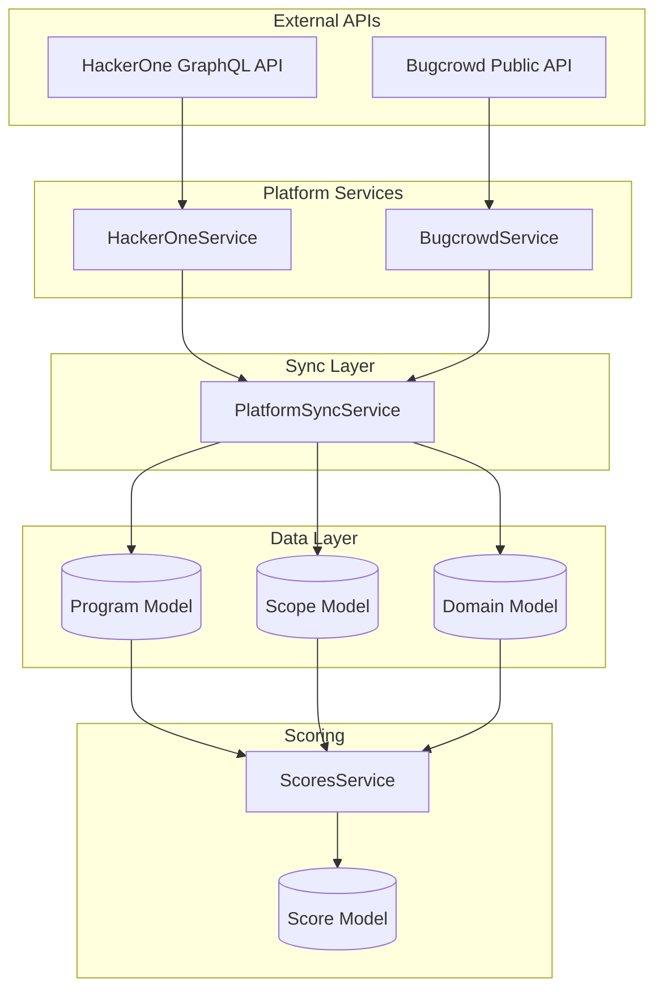

# Design Document: Platform Data Enrichment

## Overview

This feature enhances the bug bounty platform synchronization system to collect comprehensive program data from HackerOne and Bugcrowd, enabling accurate and differentiated scoring for each program. Currently, all programs receive similar scores because only basic metadata is collected. This design addresses that by:

1. Expanding the HackerOne GraphQL query to fetch bounty tables, response metrics, and activity statistics
2. Enhancing Bugcrowd data collection to capture reward ranges and scope details
3. Updating the Program schema to store enriched data
4. Modifying the scoring algorithm to use the new data fields for differentiated scoring

## Architecture



## Components and Interfaces

### 1. Enhanced HackerOneService

The HackerOne service will be updated to fetch additional data via the GraphQL API.

```typescript
// Enhanced HackerOneProgram interface
export interface HackerOneProgram {
  id: string;
  handle: string;
  name: string;
  url: string;
  state: string;
  submissionState: string;
  offersBounties: boolean;
  
  // NEW: Bounty information
  bountyTable: BountyTier[] | null;
  
  // NEW: Response metrics
  responseMetrics: {
    averageTimeToFirstResponse: number | null;  // in days
    averageTimeToBounty: number | null;         // in days
    averageTimeToResolution: number | null;     // in days
  } | null;
  
  // NEW: Activity statistics
  activityStats: {
    resolvedReportCount: number | null;
    totalBountiesPaid: number | null;
    hackersThanked: number | null;
  } | null;
  
  // NEW: Program dates
  launchedAt: string | null;
  
  scopes: HackerOneScope[];
  createdAt: string;
  updatedAt: string;
}

export interface BountyTier {
  severity: string;  // 'critical', 'high', 'medium', 'low'
  min: number;
  max: number;
}
```

### 2. Enhanced BugcrowdService

```typescript
// Enhanced BugcrowdProgram interface
export interface BugcrowdProgram {
  id: string;
  code: string;
  name: string;
  url: string;
  programUrl: string;
  status: string;
  managed: boolean;
  
  // Reward information
  minRewards: number | null;
  maxRewards: number | null;
  
  // NEW: Scope statistics
  scopeStats: {
    totalAssets: number;
    wildcardCount: number;
    domainCount: number;
    apiCount: number;
    mobileAppCount: number;
    bountyEligibleCount: number;
  };
  
  scopes: BugcrowdScope[];
  createdAt: string;
  updatedAt: string;
}
```

### 3. Enhanced Program Schema

```typescript
// New fields to add to Program schema
@Prop({ type: Object })
bountyTable: {
  critical?: { min: number; max: number };
  high?: { min: number; max: number };
  medium?: { min: number; max: number };
  low?: { min: number; max: number };
};

@Prop({ type: Object })
responseMetrics: {
  averageTimeToFirstResponse?: number;  // days
  averageTimeToBounty?: number;         // days
  averageTimeToResolution?: number;     // days
};

@Prop({ type: Object })
activityStats: {
  resolvedReportCount?: number;
  totalBountiesPaid?: number;
  hackersThanked?: number;
};

@Prop({ type: Object })
scopeStats: {
  totalAssets?: number;
  wildcardCount?: number;
  domainCount?: number;
  apiCount?: number;
  mobileAppCount?: number;
  bountyEligibleCount?: number;
};

@Prop()
launchedAt: Date;
```

### 4. Enhanced PlatformSyncService

The sync service will be updated to:
- Extract and transform the new data fields
- Calculate scope statistics during sync
- Handle missing data gracefully (store null, not zero)

### 5. Enhanced ScoresService

The scoring service will use the new data for differentiated scoring:

```typescript
// Updated scoring weights and calculations
private calculateProgramQuality(program: ProgramDocument, ...): ProgramQualityBreakdown {
  // Use actual bounty table data
  const criticalBountyMax = program.bountyTable?.critical?.max || 0;
  const bountyMaxScore = Math.min(100, (criticalBountyMax / 10000) * 100);
  
  // Use response metrics
  const responseTime = program.responseMetrics?.averageTimeToFirstResponse;
  const responseScore = responseTime 
    ? Math.max(0, 100 - (responseTime * 5))  // Faster = higher score
    : 50;  // Default neutral if no data
  
  // Use activity stats
  const resolvedReports = program.activityStats?.resolvedReportCount || 0;
  const activityScore = Math.min(100, resolvedReports / 10);
  
  // ... combine into total
}
```

## Data Models

### Program Document (Updated)

| Field | Type | Description |
|-------|------|-------------|
| bountyTable | Object | Bounty amounts by severity level |
| bountyTable.critical | {min, max} | Critical severity bounty range |
| bountyTable.high | {min, max} | High severity bounty range |
| bountyTable.medium | {min, max} | Medium severity bounty range |
| bountyTable.low | {min, max} | Low severity bounty range |
| responseMetrics | Object | Program response time statistics |
| responseMetrics.averageTimeToFirstResponse | number | Days to first response |
| responseMetrics.averageTimeToBounty | number | Days to bounty payment |
| responseMetrics.averageTimeToResolution | number | Days to resolution |
| activityStats | Object | Program activity statistics |
| activityStats.resolvedReportCount | number | Total resolved reports |
| activityStats.totalBountiesPaid | number | Total bounties paid in USD |
| activityStats.hackersThanked | number | Number of hackers thanked |
| scopeStats | Object | Scope asset statistics |
| scopeStats.totalAssets | number | Total in-scope assets |
| scopeStats.wildcardCount | number | Number of wildcard scopes |
| scopeStats.domainCount | number | Number of domain scopes |
| scopeStats.apiCount | number | Number of API scopes |
| scopeStats.mobileAppCount | number | Number of mobile app scopes |
| scopeStats.bountyEligibleCount | number | Assets eligible for bounty |
| launchedAt | Date | Program launch date |

## Correctness Properties

*A property is a characteristic or behavior that should hold true across all valid executions of a system-essentially, a formal statement about what the system should do. Properties serve as the bridge between human-readable specifications and machine-verifiable correctness guarantees.*

### Property 1: Bounty Data Extraction Preserves Values

*For any* HackerOne API response containing bounty table data, the extracted bounty values stored in the Program document SHALL equal the original API values without modification or default substitution.

**Validates: Requirements 1.1, 1.2**

### Property 2: Missing Data Results in Null Not Zero

*For any* API response where bounty, response metrics, or activity data is missing or undefined, the corresponding Program document fields SHALL be null rather than zero or any default numeric value.

**Validates: Requirements 1.4, 2.4, 6.3**

### Property 3: Response Metrics Extraction Accuracy

*For any* HackerOne API response containing response time metrics, the extracted values for time to first response, time to bounty, and time to resolution SHALL match the API values.

**Validates: Requirements 2.1, 2.2, 2.3**

### Property 4: Activity Statistics Extraction Accuracy

*For any* HackerOne API response containing activity statistics, the extracted values for resolved reports, total bounties paid, and hackers thanked SHALL match the API values.

**Validates: Requirements 3.1, 3.2, 3.3, 3.4**

### Property 5: Scope Statistics Calculation Correctness

*For any* program with scopes, the calculated scope statistics (total assets, wildcard count, domain count, API count, mobile app count, bounty-eligible count) SHALL accurately reflect the actual scope data.

**Validates: Requirements 4.1, 4.2, 4.3**

### Property 6: Bounty Amount Score Differentiation

*For any* two programs where one has a higher maximum critical bounty than the other, the program with the higher bounty SHALL receive a higher program quality score (assuming other factors are equal).

**Validates: Requirements 1.5, 5.1**

### Property 7: Response Time Score Differentiation

*For any* two programs where one has a faster average time to first response, the faster-responding program SHALL receive a higher program quality score (assuming other factors are equal).

**Validates: Requirements 2.5, 5.2**

### Property 8: Attack Surface Score Differentiation

*For any* two programs where one has more in-scope assets, the program with more assets SHALL receive a higher attack surface score (assuming other factors are equal).

**Validates: Requirements 4.4, 5.3**

### Property 9: Wildcard Scope Score Bonus

*For any* two programs with equal total scope counts, the program with wildcard scopes SHALL receive a higher program quality score than the program without wildcards.

**Validates: Requirements 4.5**

### Property 10: Confidence Score Reflects Data Completeness

*For any* program, the confidence score SHALL be higher when more data fields (bounty, response metrics, activity stats, scope stats) are populated with non-null values.

**Validates: Requirements 5.4**

### Property 11: Rate Limit Retry with Exponential Backoff

*For any* sequence of rate limit errors from the HackerOne API, the retry delays SHALL increase exponentially with each consecutive failure.

**Validates: Requirements 6.1**

### Property 12: Error Isolation - Sync Continues After Individual Failures

*For any* sync operation where one program fails to sync, the remaining programs SHALL still be processed and synced successfully.

**Validates: Requirements 6.2**

## Error Handling

### API Errors

| Error Type | Handling Strategy |
|------------|-------------------|
| Rate Limit (429) | Exponential backoff: 1s, 2s, 4s, 8s, max 3 retries |
| Network Error | Retry once after 5s, then skip program |
| Invalid Response | Log error, store null for affected fields |
| Partial Data | Store available data, null for missing fields |

### Data Validation

- Bounty amounts: Must be non-negative numbers or null
- Response times: Must be non-negative numbers or null
- Counts: Must be non-negative integers or null
- Dates: Must be valid ISO date strings or null

## Testing Strategy

### Dual Testing Approach

This feature requires both unit tests and property-based tests:

1. **Unit Tests**: Verify specific examples and edge cases
2. **Property-Based Tests**: Verify universal properties across all valid inputs

### Property-Based Testing Framework

The project uses **fast-check** for property-based testing in TypeScript/JavaScript.

### Test Categories

#### 1. Data Extraction Tests (Property-Based)

Test that data extraction from API responses preserves values correctly:
- Generate random valid API responses
- Verify extracted data matches input
- Verify null handling for missing fields

#### 2. Score Differentiation Tests (Property-Based)

Test that scores differentiate based on data:
- Generate pairs of programs with different values
- Verify score ordering matches expected ordering

#### 3. Scope Statistics Tests (Property-Based)

Test scope counting accuracy:
- Generate random scope configurations
- Verify counts match actual scope data

#### 4. Error Handling Tests (Unit)

Test specific error scenarios:
- Rate limit responses trigger retry
- Network errors don't crash sync
- Partial data is handled gracefully

### Test Annotations

Each property-based test MUST be tagged with:
```typescript
// **Feature: platform-data-enrichment, Property {number}: {property_text}**
```

### Minimum Iterations

Property-based tests MUST run a minimum of 100 iterations to ensure adequate coverage.

