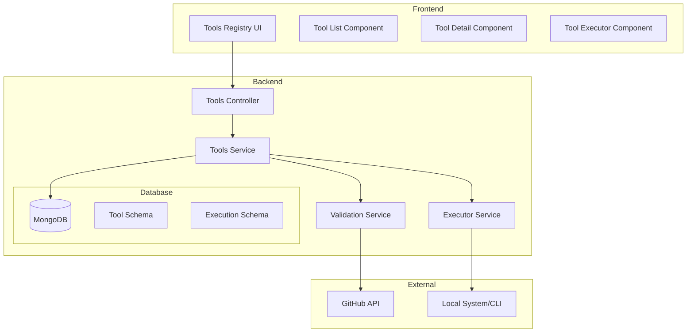

# Design Document: Security Tools Registry

## Overview

The Security Tools Registry is a comprehensive system for managing, validating, and executing security reconnaissance tools within the bug bounty automation platform. It provides a centralized catalog of 35+ security tools with metadata, validation, execution capabilities, and a modern UI for tool management.

The system integrates with the existing NestJS backend architecture and Next.js frontend, adding new modules for tool management while leveraging existing patterns for consistency.

## Architecture



## Components and Interfaces

### Backend Components

#### 1. Tools Module (`backend/src/modules/tools/`)

```typescript
// tools.module.ts
@Module({
  imports: [MongooseModule.forFeature([
    { name: Tool.name, schema: ToolSchema },
    { name: ToolExecution.name, schema: ToolExecutionSchema }
  ])],
  controllers: [ToolsController],
  providers: [ToolsService, ValidationService, ExecutorService],
  exports: [ToolsService]
})
export class ToolsModule {}
```

#### 2. Tools Controller Interface

```typescript
// tools.controller.ts
interface ToolsControllerInterface {
  // GET /api/tools - List all tools with optional filters
  getAll(query: ToolQueryDto): Promise<Tool[]>;
  
  // GET /api/tools/:id - Get single tool details
  getById(id: string): Promise<Tool>;
  
  // POST /api/tools - Add new tool (with validation)
  create(dto: CreateToolDto): Promise<Tool>;
  
  // PUT /api/tools/:id - Update tool
  update(id: string, dto: UpdateToolDto): Promise<Tool>;
  
  // DELETE /api/tools/:id - Remove tool
  delete(id: string): Promise<void>;
  
  // POST /api/tools/bulk-import - Import predefined tools
  bulkImport(): Promise<BulkImportResult>;
  
  // POST /api/tools/:id/execute - Execute a tool
  execute(id: string, dto: ExecuteToolDto): Promise<ToolExecution>;
  
  // GET /api/tools/:id/executions - Get execution history
  getExecutions(id: string, query: ExecutionQueryDto): Promise<ToolExecution[]>;
  
  // GET /api/tools/:id/status - Check installation status
  checkStatus(id: string): Promise<ToolStatus>;
  
  // POST /api/tools/:id/validate - Re-validate tool
  validate(id: string): Promise<ValidationResult>;
}
```

#### 3. Validation Service Interface

```typescript
// validation.service.ts
interface ValidationServiceInterface {
  // Validate a GitHub repository URL
  validateGitHubRepo(url: string): Promise<ValidationResult>;
  
  // Check repository metrics (stars, activity)
  checkRepoMetrics(owner: string, repo: string): Promise<RepoMetrics>;
  
  // Verify tool legitimacy
  isLegitimate(metrics: RepoMetrics): boolean;
}

interface ValidationResult {
  valid: boolean;
  reason?: string;
  metrics?: RepoMetrics;
}

interface RepoMetrics {
  stars: number;
  lastCommitDate: Date;
  openIssues: number;
  forks: number;
  license: string | null;
}
```

#### 4. Executor Service Interface

```typescript
// executor.service.ts
interface ExecutorServiceInterface {
  // Check if tool is installed locally
  isInstalled(toolName: string, binaryName?: string): Promise<boolean>;
  
  // Get installed version
  getVersion(toolName: string): Promise<string | null>;
  
  // Execute tool with arguments
  execute(tool: Tool, args: string[], options?: ExecuteOptions): Promise<ToolExecution>;
  
  // Stream execution output
  streamOutput(executionId: string): Observable<string>;
}

interface ExecuteOptions {
  timeout?: number;
  workingDir?: string;
  env?: Record<string, string>;
}
```

### Frontend Components

#### 1. Tools Registry Page (`frontend/src/app/dashboard/tools/page.tsx`)

Main page displaying the tool catalog with:
- Search bar for tool name filtering
- Category filter dropdown/tabs
- Grid/list view of tools
- Quick actions (execute, configure, view details)

#### 2. Tool Detail Page (`frontend/src/app/dashboard/tools/[id]/page.tsx`)

Detailed view showing:
- Tool metadata (name, description, GitHub link)
- Installation status with install/update buttons
- Configuration panel
- Execution history
- Execute button with argument input

#### 3. Tool Execution Modal

Real-time execution view with:
- Live stdout/stderr streaming
- Progress indicator
- Cancel button
- Output download option

## Data Models

### Tool Schema

```typescript
// backend/src/schemas/tool.schema.ts
@Schema({ timestamps: true })
export class Tool {
  @Prop({ required: true, unique: true })
  name: string;

  @Prop({ required: true })
  displayName: string;

  @Prop({ required: true })
  description: string;

  @Prop({ required: true })
  githubUrl: string;

  @Prop({ type: [String], enum: ToolCategory })
  categories: ToolCategory[];

  @Prop({ type: Object })
  validation: {
    isValid: boolean;
    lastChecked: Date;
    stars: number;
    lastCommit: Date;
    reason?: string;
  };

  @Prop({ type: Object })
  installation: {
    isInstalled: boolean;
    version?: string;
    binaryName: string;
    lastChecked: Date;
  };

  @Prop({ type: [Object] })
  configOptions: ConfigOption[];

  @Prop({ type: Object })
  userConfig: Record<string, any>;

  @Prop({ default: true })
  isActive: boolean;
}

enum ToolCategory {
  SUBDOMAIN_ENUMERATION = 'subdomain_enumeration',
  HTTP_PROBING = 'http_probing',
  DIRECTORY_FUZZING = 'directory_fuzzing',
  VULNERABILITY_SCANNING = 'vulnerability_scanning',
  SECRET_DETECTION = 'secret_detection',
  JAVASCRIPT_ANALYSIS = 'javascript_analysis',
  PORT_SCANNING = 'port_scanning',
  WAF_DETECTION = 'waf_detection',
  URL_DISCOVERY = 'url_discovery',
  OSINT = 'osint',
  DNS_TOOLS = 'dns_tools',
  WEB_CRAWLING = 'web_crawling',
  PARAMETER_DISCOVERY = 'parameter_discovery',
  EXPLOITATION = 'exploitation'
}

interface ConfigOption {
  name: string;
  flag: string;
  type: 'string' | 'number' | 'boolean' | 'file';
  description: string;
  required: boolean;
  default?: any;
}
```

### Tool Execution Schema

```typescript
// backend/src/schemas/tool-execution.schema.ts
@Schema({ timestamps: true })
export class ToolExecution {
  @Prop({ type: Types.ObjectId, ref: 'Tool', required: true })
  tool: Tool;

  @Prop({ type: [String] })
  arguments: string[];

  @Prop({ type: Object })
  config: Record<string, any>;

  @Prop({ enum: ['pending', 'running', 'completed', 'failed', 'cancelled'] })
  status: string;

  @Prop()
  stdout: string;

  @Prop()
  stderr: string;

  @Prop()
  exitCode: number;

  @Prop()
  startedAt: Date;

  @Prop()
  completedAt: Date;

  @Prop()
  duration: number; // milliseconds

  @Prop()
  errorMessage?: string;
}
```

### DTOs

```typescript
// dto/tool.dto.ts
export class CreateToolDto {
  @IsString()
  name: string;

  @IsString()
  displayName: string;

  @IsString()
  description: string;

  @IsUrl()
  githubUrl: string;

  @IsArray()
  @IsEnum(ToolCategory, { each: true })
  categories: ToolCategory[];

  @IsString()
  binaryName: string;

  @IsOptional()
  @IsArray()
  configOptions?: ConfigOption[];
}

export class ToolQueryDto {
  @IsOptional()
  @IsString()
  search?: string;

  @IsOptional()
  @IsEnum(ToolCategory)
  category?: ToolCategory;

  @IsOptional()
  @IsBoolean()
  installedOnly?: boolean;
}

export class ExecuteToolDto {
  @IsArray()
  @IsString({ each: true })
  arguments: string[];

  @IsOptional()
  @IsObject()
  config?: Record<string, any>;

  @IsOptional()
  @IsNumber()
  timeout?: number;
}
```


## Correctness Properties

*A property is a characteristic or behavior that should hold true across all valid executions of a system-essentially, a formal statement about what the system should do. Properties serve as the bridge between human-readable specifications and machine-verifiable correctness guarantees.*

### Property 1: Tool Data Completeness
*For any* tool in the registry, the tool record SHALL contain all required fields: name, displayName, description, githubUrl (valid URL format), and at least one category.
**Validates: Requirements 1.1, 1.4**

### Property 2: Category Filter Correctness
*For any* category filter applied to the tool list, all returned tools SHALL have that category in their categories array, and no tools with that category SHALL be excluded.
**Validates: Requirements 1.2**

### Property 3: Search Filter Correctness
*For any* search term applied to the tool list, all returned tools SHALL have names containing the search term (case-insensitive), and no tools matching the search term SHALL be excluded.
**Validates: Requirements 1.3**

### Property 4: GitHub URL Validation
*For any* tool creation request, the githubUrl field SHALL match the pattern `https://github.com/{owner}/{repo}` and the system SHALL reject URLs not matching this pattern.
**Validates: Requirements 2.1**

### Property 5: Star Threshold Validation
*For any* repository metrics with stars < 100, the validation result SHALL be invalid with reason containing "stars".
**Validates: Requirements 2.2**

### Property 6: Activity Threshold Validation
*For any* repository metrics with lastCommitDate older than 12 months from current date, the validation result SHALL be invalid with reason containing "activity" or "inactive".
**Validates: Requirements 2.3**

### Property 7: Validation Rejection Reason
*For any* tool that fails validation, the rejection response SHALL include a non-empty reason string explaining the failure.
**Validates: Requirements 2.4**

### Property 8: Valid Tool Persistence
*For any* tool that passes validation and is created, querying for that tool SHALL return a record with all submitted fields preserved.
**Validates: Requirements 2.5**

### Property 9: Installation Status Enum
*For any* tool's installation status, the status SHALL be exactly one of: "installed", "not_installed", or "update_available".
**Validates: Requirements 3.1**

### Property 10: Version Comparison
*For any* tool where installed version differs from latest version, the installation status SHALL be "update_available".
**Validates: Requirements 3.3**

### Property 11: Execution Precondition
*For any* tool execution request where the tool is not installed, the execution SHALL fail with an error indicating the tool is not installed.
**Validates: Requirements 4.1**

### Property 12: Execution Result Completeness
*For any* completed tool execution, the execution record SHALL contain: stdout (string), stderr (string), exitCode (number), startedAt (date), completedAt (date), and duration (number >= 0).
**Validates: Requirements 4.2, 4.3**

### Property 13: Failed Execution Error Message
*For any* tool execution with status "failed", the execution record SHALL contain a non-empty errorMessage field.
**Validates: Requirements 4.4**

### Property 14: Category Enum Validity
*For any* tool's categories array, each category SHALL be a valid ToolCategory enum value.
**Validates: Requirements 5.1**

### Property 15: Category Grouping Correctness
*For any* grouping of tools by category, each tool SHALL appear in all groups corresponding to its categories, and no tool SHALL appear in a group for a category it doesn't have.
**Validates: Requirements 5.3**

### Property 16: Configuration Round-Trip
*For any* tool configuration that is saved, retrieving the tool's configuration SHALL return the exact same configuration values.
**Validates: Requirements 6.1, 6.2**

### Property 17: Execution Uses Saved Config
*For any* tool execution, the execution record's config field SHALL match the tool's userConfig at the time of execution.
**Validates: Requirements 6.3**

### Property 18: Bulk Import Completeness
*For any* bulk import operation, the result SHALL report successCount + failureCount equal to the total number of tools in the predefined list.
**Validates: Requirements 7.1, 7.2, 7.3**

### Property 19: Execution History Limit
*For any* request for a tool's execution history without pagination, the result SHALL contain at most 10 executions.
**Validates: Requirements 8.1**

### Property 20: Execution Detail Completeness
*For any* execution detail request, the response SHALL include the full stdout, stderr, and the config used for that execution.
**Validates: Requirements 8.2**

### Property 21: Execution History Date Filter
*For any* date range filter on execution history, all returned executions SHALL have startedAt within the specified range.
**Validates: Requirements 8.3**

## Error Handling

### Validation Errors
- Invalid GitHub URL format: Return 400 with message "Invalid GitHub URL format. Expected: https://github.com/{owner}/{repo}"
- Repository not found: Return 400 with message "GitHub repository not found"
- Insufficient stars: Return 400 with message "Repository has fewer than 100 stars (found: {count})"
- Inactive repository: Return 400 with message "Repository has been inactive for more than 12 months"

### Execution Errors
- Tool not installed: Return 400 with message "Tool '{name}' is not installed. Please install it first."
- Execution timeout: Return 408 with message "Tool execution timed out after {timeout}ms"
- Tool crashed: Return 500 with message "Tool execution failed with exit code {code}: {stderr}"

### General Errors
- Tool not found: Return 404 with message "Tool with ID '{id}' not found"
- Duplicate tool: Return 409 with message "Tool with name '{name}' already exists"

## Testing Strategy

### Property-Based Testing Library
The project will use **fast-check** for property-based testing in TypeScript/JavaScript.

### Unit Tests
Unit tests will cover:
- GitHub URL parsing and validation
- Date comparison for activity threshold
- Version string comparison
- Category enum validation
- Configuration merging logic

### Property-Based Tests
Each correctness property will be implemented as a property-based test using fast-check. Tests will:
- Generate random tool data with valid/invalid combinations
- Generate random search terms and verify filter correctness
- Generate random dates for activity validation
- Generate random execution results and verify completeness

Property-based tests will be configured to run a minimum of 100 iterations each.

Each property-based test will be tagged with a comment in the format:
`**Feature: security-tools-registry, Property {number}: {property_text}**`

### Integration Tests
Integration tests will verify:
- End-to-end tool creation with GitHub API validation
- Tool execution with actual CLI tools (using safe test tools)
- Bulk import workflow
- WebSocket streaming for execution output

## Predefined Tools List

The following tools will be included in the bulk import:

| Name | Binary | Categories | GitHub URL |
|------|--------|------------|------------|
| sqlmap | sqlmap | exploitation | https://github.com/sqlmapproject/sqlmap |
| whois | whois | osint | https://github.com/rfc1036/whois |
| httpx | httpx | http_probing | https://github.com/projectdiscovery/httpx |
| dirsearch | dirsearch | directory_fuzzing | https://github.com/maurosoria/dirsearch |
| katana | katana | web_crawling, url_discovery | https://github.com/projectdiscovery/katana |
| subfinder | subfinder | subdomain_enumeration | https://github.com/projectdiscovery/subfinder |
| waybackurls | waybackurls | url_discovery | https://github.com/tomnomnom/waybackurls |
| trufflehog | trufflehog | secret_detection | https://github.com/trufflesecurity/trufflehog |
| nmap | nmap | port_scanning | https://github.com/nmap/nmap |
| amass | amass | subdomain_enumeration, osint | https://github.com/owasp-amass/amass |
| findomain | findomain | subdomain_enumeration | https://github.com/Findomain/Findomain |
| dnsx | dnsx | dns_tools | https://github.com/projectdiscovery/dnsx |
| shuffledns | shuffledns | dns_tools, subdomain_enumeration | https://github.com/projectdiscovery/shuffledns |
| gau | gau | url_discovery | https://github.com/lc/gau |
| hakrawler | hakrawler | web_crawling | https://github.com/hakluke/hakrawler |
| urlfinder | urlfinder | url_discovery, javascript_analysis | https://github.com/projectdiscovery/urlfinder |
| ffuf | ffuf | directory_fuzzing, parameter_discovery | https://github.com/ffuf/ffuf |
| feroxbuster | feroxbuster | directory_fuzzing | https://github.com/epi052/feroxbuster |
| arjun | arjun | parameter_discovery | https://github.com/s0md3v/Arjun |
| linkfinder | linkfinder | javascript_analysis, url_discovery | https://github.com/GerbenJavado/LinkFinder |
| secretfinder | secretfinder | secret_detection, javascript_analysis | https://github.com/m4ll0k/SecretFinder |
| jsparser | jsparser | javascript_analysis | https://github.com/nahamsec/JSParser |
| mantra | mantra | parameter_discovery | https://github.com/MrEmpy/mantra |
| whatweb | whatweb | http_probing | https://github.com/urbanadventurer/WhatWeb |
| assetfinder | assetfinder | subdomain_enumeration | https://github.com/tomnomnom/assetfinder |
| nuclei | nuclei | vulnerability_scanning | https://github.com/projectdiscovery/nuclei |
| wafw00f | wafw00f | waf_detection | https://github.com/EnableSecurity/wafw00f |
| spyhunt | spyhunt | osint | https://github.com/spyhunt/spyhunt |
| metasploit | msfconsole | exploitation | https://github.com/rapid7/metasploit-framework |

