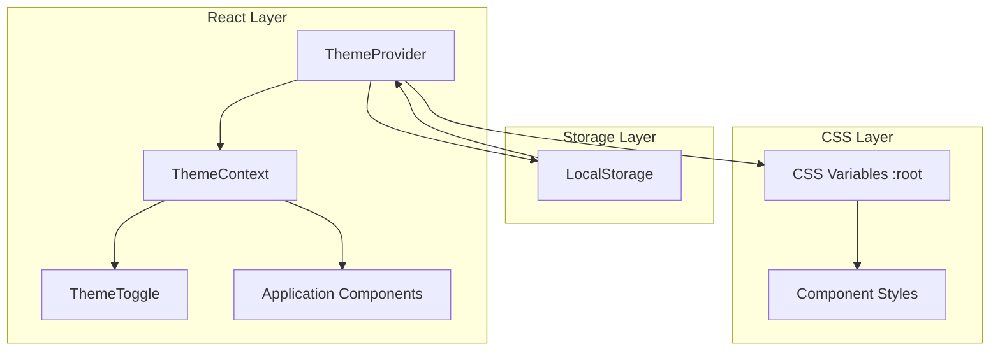

# Design Document: Theme System

## Overview

The theme system provides a flexible, CSS variable-based theming architecture for the Bug Bounty Automation Platform. It enables users to switch between visual themes (cyberpunk default and Christmas) with instant application and persistent preferences. The system leverages React Context for state management and CSS custom properties for style propagation.

## Architecture



## Components and Interfaces

### ThemeContext

```typescript
// Theme type definitions
type ThemeName = 'cyberpunk' | 'christmas';

interface ThemeColors {
  // Primary accent
  accentPrimary: string;
  accentPrimaryHover: string;
  
  // Secondary accents
  accentSecondary: string;
  accentTertiary: string;
  accentQuaternary: string;
  
  // Backgrounds
  bgPrimary: string;
  bgCard: string;
  bgHover: string;
  
  // Borders and effects
  borderPrimary: string;
  glowColor: string;
  
  // Scrollbar
  scrollbarThumb: string;
  scrollbarThumbHover: string;
  
  // Grid pattern color
  gridPatternColor: string;
}

interface ThemeContextValue {
  theme: ThemeName;
  setTheme: (theme: ThemeName) => void;
  colors: ThemeColors;
}
```

### ThemeProvider Component

```typescript
interface ThemeProviderProps {
  children: React.ReactNode;
  defaultTheme?: ThemeName;
}

// ThemeProvider wraps the application and:
// 1. Initializes theme from localStorage or default
// 2. Provides theme context to children
// 3. Updates CSS variables when theme changes
// 4. Persists theme changes to localStorage
```

### ThemeToggle Component

```typescript
interface ThemeToggleProps {
  className?: string;
}

// ThemeToggle renders:
// 1. A button showing current theme icon
// 2. A dropdown with available themes
// 3. Visual indicator for active theme
```

## Data Models

### Theme Definitions

```typescript
const THEMES: Record<ThemeName, ThemeColors> = {
  cyberpunk: {
    accentPrimary: '#22c55e',      // Green
    accentPrimaryHover: '#16a34a',
    accentSecondary: '#00f5ff',    // Cyan
    accentTertiary: '#a855f7',     // Purple
    accentQuaternary: '#ec4899',   // Pink
    bgPrimary: '#0a0a0f',
    bgCard: '#111118',
    bgHover: '#1a1a24',
    borderPrimary: '#1e293b',
    glowColor: '#22c55e',
    scrollbarThumb: '#22c55e',
    scrollbarThumbHover: '#16a34a',
    gridPatternColor: '#22c55e',
  },
  christmas: {
    accentPrimary: '#dc2626',      // Red
    accentPrimaryHover: '#b91c1c',
    accentSecondary: '#16a34a',    // Green
    accentTertiary: '#fbbf24',     // Gold
    accentQuaternary: '#f87171',   // Light red
    bgPrimary: '#0f0a0a',          // Warm dark
    bgCard: '#181111',             // Warm card
    bgHover: '#241818',
    borderPrimary: '#3b1e1e',
    glowColor: '#dc2626',
    scrollbarThumb: '#dc2626',
    scrollbarThumbHover: '#b91c1c',
    gridPatternColor: '#16a34a',
  },
};
```

### LocalStorage Schema

```typescript
// Key: 'bb-platform-theme'
// Value: ThemeName (string)

const STORAGE_KEY = 'bb-platform-theme';
```

## Correctness Properties

*A property is a characteristic or behavior that should hold true across all valid executions of a system—essentially, a formal statement about what the system should do. Properties serve as the bridge between human-readable specifications and machine-verifiable correctness guarantees.*

### Property 1: Theme Persistence Round-Trip

*For any* valid theme name, when the theme is selected and persisted to localStorage, then reloading the application should restore that same theme.

**Validates: Requirements 1.1, 1.2**

### Property 2: Immediate CSS Variable Update

*For any* theme change, the CSS custom properties on the document root element should immediately reflect the new theme's color definitions without requiring a page refresh.

**Validates: Requirements 1.4, 3.2**

### Property 3: Comprehensive Theme Application

*For any* theme in the theme registry, applying that theme should update all CSS variables (accent colors, backgrounds, borders, glow effects, scrollbar colors, grid pattern) to match the theme's defined values.

**Validates: Requirements 6.1, 6.2, 6.3, 6.4**

## Error Handling

| Error Scenario | Handling Strategy |
|----------------|-------------------|
| localStorage unavailable | Fall back to in-memory state, theme won't persist across sessions |
| Invalid theme in localStorage | Reset to default cyberpunk theme and update localStorage |
| CSS variable update fails | Log error, continue with previous theme |

## Testing Strategy

### Unit Tests
- Verify cyberpunk theme has correct color values (4.1, 4.2, 4.3)
- Verify Christmas theme has correct color values (5.1, 5.2, 5.3, 5.4, 5.5)
- Verify default theme is applied when localStorage is empty (1.3)
- Verify ThemeToggle renders in navigation area (2.1)
- Verify ThemeToggle shows options on click (2.2)
- Verify active theme indication (2.4)
- Verify all color categories exist in theme definitions (3.3)

### Property-Based Tests
- Use fast-check library for property-based testing
- Minimum 100 iterations per property test
- Tag format: **Feature: theme-system, Property {number}: {property_text}**

Property tests will:
1. Generate random theme selections and verify round-trip persistence
2. Generate theme changes and verify CSS variables update correctly
3. Verify all themes have complete CSS variable coverage

