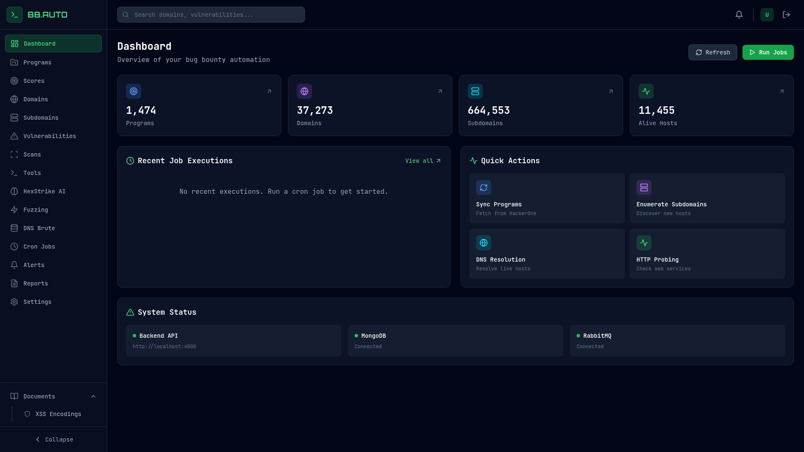

# BB.AUTO — پلتفرم اتوماسیون باگ‌بانتی

<div dir="rtl">

BB.AUTO یک workspace خودمیزبان برای مدیریت برنامه‌های باگ‌بانتی، نقشه‌برداری
از سطح حمله، اجرای jobهای شناسایی و نگهداری نتایج اسکن است. فرانت‌اند با
Next.js، API با NestJS، ذخیره‌سازی با MongoDB و workerها با RabbitMQ ساخته شده‌اند.

</div>



> این ابزار را فقط روی دارایی‌هایی اجرا کنید که مالک آن هستید یا اجازه‌ی تستشان
> را دارید. rate limit و محدوده‌ی اسکن باید مطابق سیاست همان برنامه تنظیم شود.

## قابلیت‌ها

- مدیریت برنامه، scope، دامنه، زیردامنه و آسیب‌پذیری
- DNS resolution، کشف زیردامنه، HTTP probing، port scan و Nuclei
- jobهای زمان‌بندی‌شده با نمایش وضعیت لحظه‌ای
- گزارش و export برای داده‌های شناسایی و یافته‌ها
- registry ابزارها، بررسی نصب و تاریخچه‌ی اجرا
- اتصال اختیاری به HexStrike AI
- اعلان از طریق Telegram، Slack، Discord و SMTP
- داشبورد responsive با checklist و scratchpad

## راه‌اندازی با Docker

پیش‌نیازها: Docker Engine و Docker Compose v2.

```bash
cp env.sample .env
docker compose -f docker-compose.dev.yml up -d --build
```

آدرس‌ها:

- داشبورد: <http://localhost:3000>
- API: <http://localhost:4000>
- مستندات Swagger: <http://localhost:4000/api/docs>
- مدیریت RabbitMQ: <http://localhost:15672>

ساخت حساب مدیر:

```bash
docker compose -f docker-compose.dev.yml exec \
  -e ADMIN_EMAIL=you@example.com \
  -e ADMIN_PASSWORD='choose-a-long-password' \
  backend npm run create-admin
```

دستورات پرکاربرد:

```bash
make status
make dev-logs
make dev-down
```

## تنظیمات حساس

فایل `env.sample` را به `.env` کپی کنید. `.env` در Git نادیده گرفته شده است؛
توکن Telegram، API key، رمز عبور و JWT secret را در کد، README یا اسکرین‌شات
قرار ندهید.

```bash
export TELEGRAM_BOT_TOKEN='token-from-botfather'
export TELEGRAM_CHAT_ID='your-chat-id'
export PROXY_PORT=10808
./start-telegram-bot.sh
```

## بخش‌های اصلی پنل

- `/dashboard` — خلاصه‌ی وضعیت و jobهای اخیر
- `/dashboard/programs` — برنامه‌ها، scope و اطلاعات پلتفرم
- `/dashboard/domains` — دامنه‌های تحت پایش
- `/dashboard/subdomains` — دارایی‌های کشف‌شده و فیلتر live
- `/dashboard/scans` — اجرای اسکن و نتایج
- `/dashboard/vulnerabilities` — یافته‌ها و شدت آسیب‌پذیری
- `/dashboard/cron` — jobهای زمان‌بندی‌شده
- `/dashboard/tools` — ابزارها، نصب، تنظیمات و خروجی
- `/dashboard/hexstrike` — workflowهای اختیاری AI
- `/dashboard/reports` — گزارش و export
- `/dashboard/checklist` — چک‌لیست شکار که در مرورگر ذخیره می‌شود

## ساختار پروژه

```text
backend/       API، workerها، صف و integrationها
frontend/      داشبورد Next.js
cli/           کلاینت خط فرمان
hexstrike-ai/  سرویس اختیاری HexStrike AI
scripts/       ابزار اسکرین‌شات و بات Telegram
docker/        اسکریپت‌های آماده‌سازی MongoDB
```

## بررسی صحت پروژه

```bash
cd backend && npm test -- --runInBand && npm run build
cd ../frontend && npm test -- --runInBand && npx tsc --noEmit && npm run build
```

برای نسخه‌ی انگلیسی به [README.md](README.md)، برای شروع سریع به
[QUICK-START.md](QUICK-START.md) و برای نقشه‌ی سیستم به
[architecture.mermaid](architecture.mermaid) مراجعه کنید.
