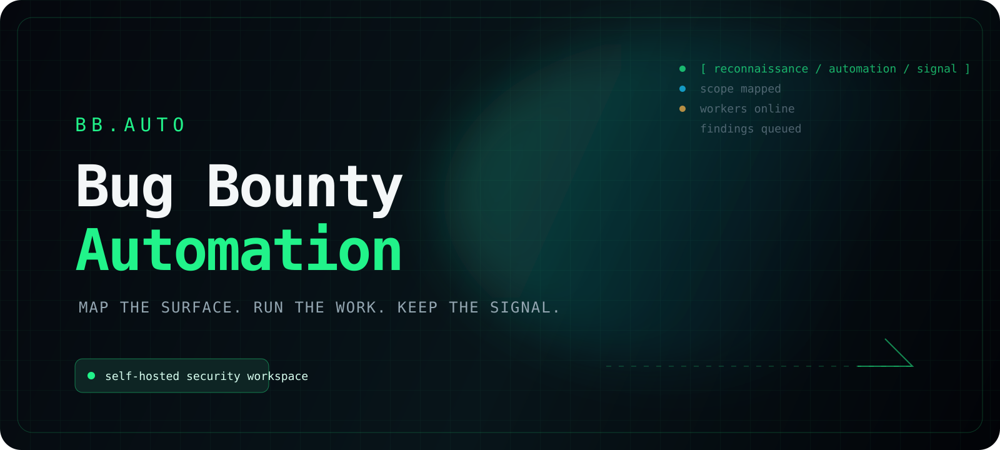
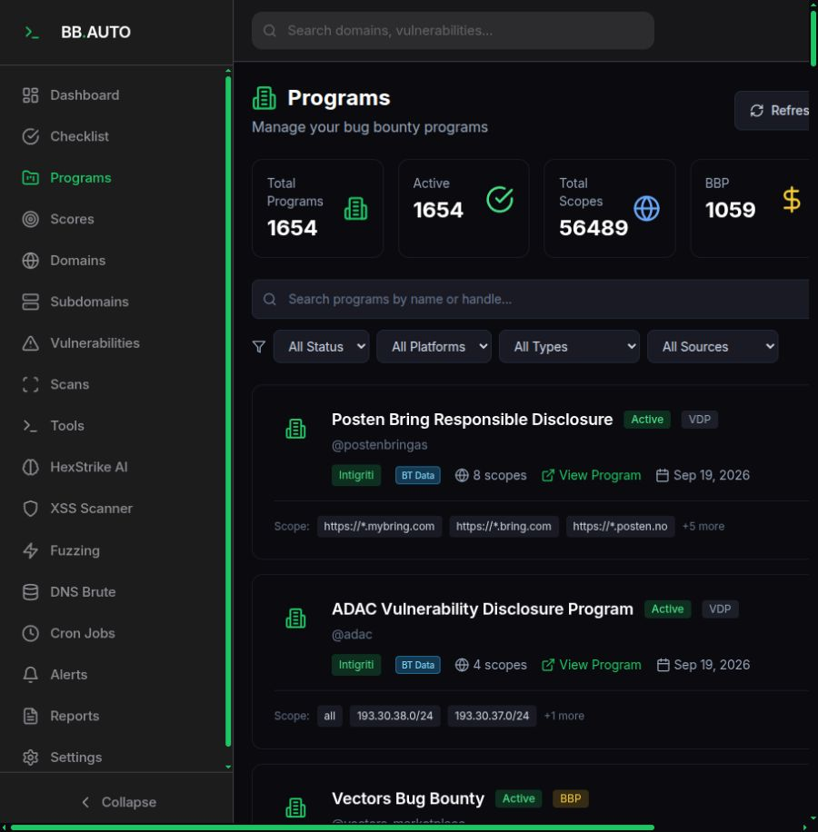
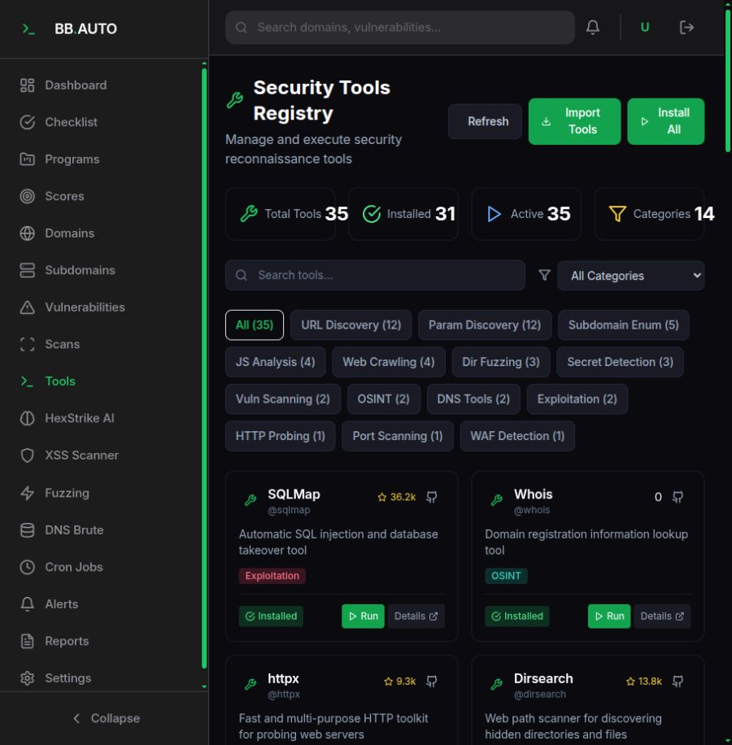
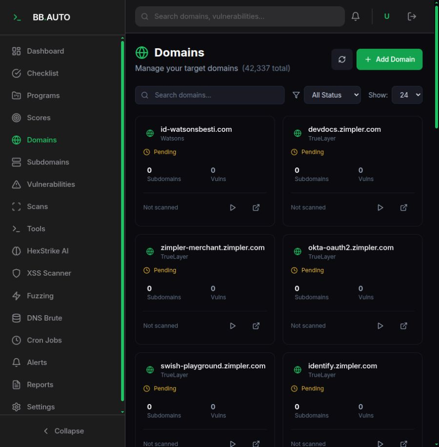
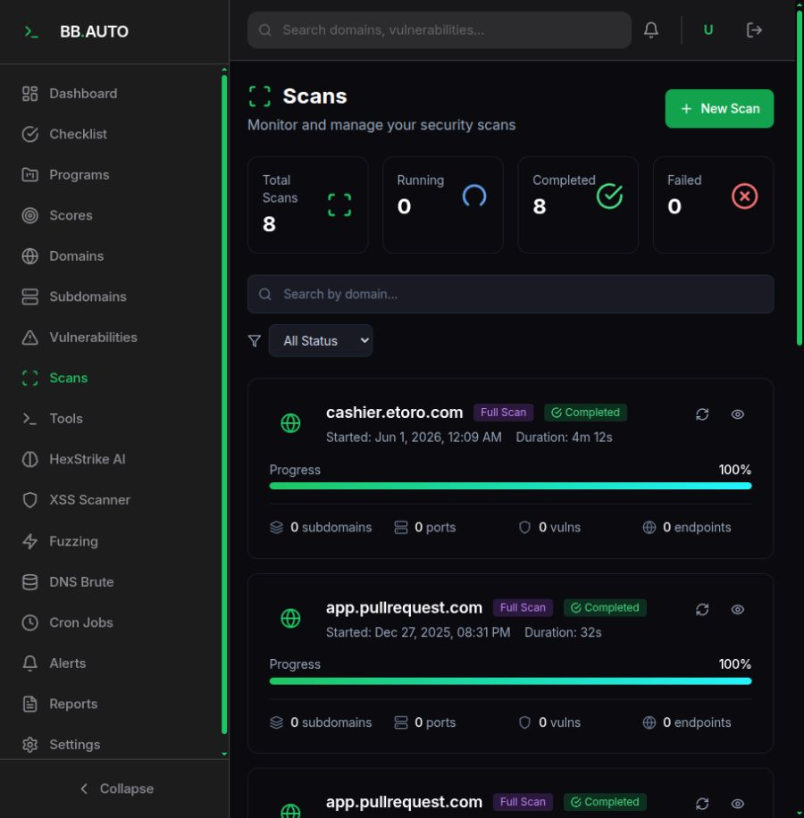
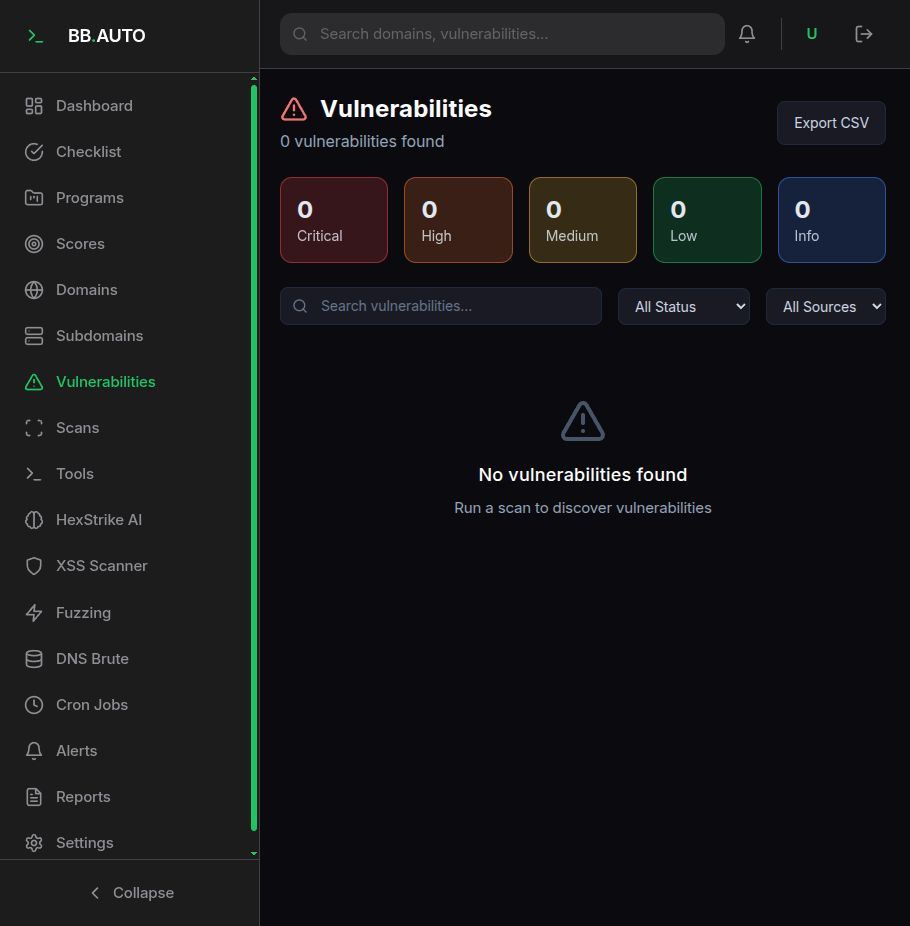
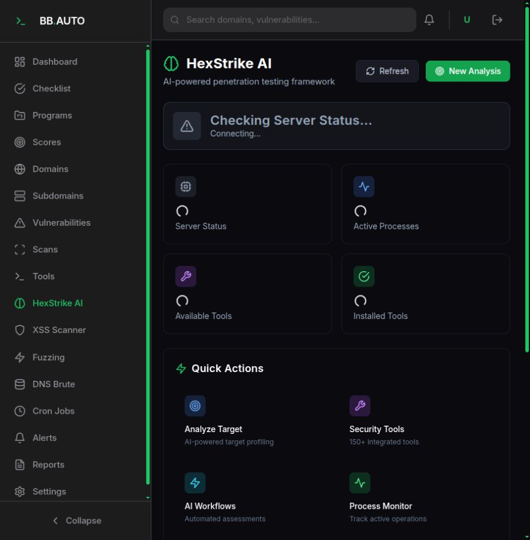
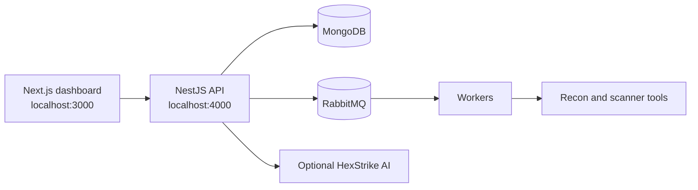

<div align="center">
  

  <p>
    <a href="https://nextjs.org/"></a>
    <a href="https://nestjs.com/"></a>
    <a href="https://www.docker.com/"></a>
    <a href="LICENSE"></a>
  </p>

  <p><strong>Map the surface. Run the work. Keep the signal.</strong></p>
</div>

## BB.AUTO

BB.AUTO is a self-hosted workspace for organizing bug bounty programs, mapping
their attack surface, running reconnaissance jobs, and keeping scan results in
one place. It combines a Next.js dashboard with a NestJS API, MongoDB,
RabbitMQ-backed workers, and optional integrations with common security tools.


> Use this project only against assets that you own or are explicitly
> authorized to test. The platform can launch active discovery and scanning
> tools; authorization and rate limits are your responsibility.

## What is included

- Program, scope, domain, subdomain, and vulnerability management
- DNS resolution, subdomain discovery, HTTP probing, port scanning, and Nuclei workflows
- Scheduled jobs with progress updates over WebSocket
- Reports and exports for reconnaissance and vulnerability data
- Tool registry with installation checks and execution history
- Optional HexStrike AI integration for guided workflows
- Notifications through Telegram, Slack, Discord, or SMTP
- A responsive dashboard with a hunting checklist and scratchpad

## Screenshots

The gallery below is captured from the current BB.AUTO interface, including the
main workspace and the pages used during reconnaissance. It uses local sample
data for demonstration; review or replace it before sharing data that is not
intended to be public.

| Dashboard | Programs |
| --- | --- |
|  |  |

| Tools | Domains |
| --- | --- |
|  |  |

| Scans | Vulnerabilities |
| --- | --- |
|  |  |

| HexStrike AI |
| --- |
|  |

## Architecture



The longer version of the system diagram is available in
[`architecture.mermaid`](architecture.mermaid).

## Quick start with Docker

### Requirements

- Docker Engine and Docker Compose v2
- Node.js 18+ only when running services or scripts outside Docker
- API keys for external providers are optional

### Development environment

```bash
cp env.sample .env
docker compose -f docker-compose.dev.yml up -d --build
```

Open the following URLs after the containers finish starting:

- Dashboard: <http://localhost:3000>
- API: <http://localhost:4000>
- Swagger documentation: <http://localhost:4000/api/docs>
- RabbitMQ management: <http://localhost:15672>

Create an administrator with credentials that are kept outside the repository:

```bash
docker compose -f docker-compose.dev.yml exec \
  -e ADMIN_EMAIL=you@example.com \
  -e ADMIN_PASSWORD='choose-a-long-password' \
  backend npm run create-admin
```

Useful commands:

```bash
make status
make dev-logs
make backend-logs
make frontend-logs
make dev-down
```

The production compose file is `docker-compose.yml`. Set real MongoDB,
RabbitMQ, JWT, and integration secrets in `.env` before using it.

## Environment variables

Copy [`env.sample`](env.sample) to `.env` and fill only the services you use.
`.env` is ignored by Git. Never put bot tokens, API keys, passwords, or JWT
secrets in source files, screenshots, shell history, or documentation.

For the Telegram bot:

```bash
export TELEGRAM_BOT_TOKEN='token-from-botfather'
export TELEGRAM_CHAT_ID='your-chat-id'
export PROXY_PORT=10808   # optional
./start-telegram-bot.sh
```

## Main areas of the dashboard

- `/dashboard` — current totals, system status, quick actions, and recent jobs
- `/dashboard/programs` — programs, platform metadata, scopes, and rewards
- `/dashboard/domains` — monitored domains and their scan history
- `/dashboard/subdomains` — discovered assets and live-host filters
- `/dashboard/scans` — scan execution and results
- `/dashboard/vulnerabilities` — findings, severity, and status tracking
- `/dashboard/cron` — scheduled reconnaissance jobs
- `/dashboard/tools` — tool health, installation, configuration, and output
- `/dashboard/hexstrike` — optional AI-assisted workflows
- `/dashboard/reports` — report generation and exports
- `/dashboard/checklist` — a practical hunting checklist stored locally in the browser

## Repository layout

```text
backend/       NestJS API, workers, queues, and integrations
frontend/      Next.js dashboard
cli/           Command-line client
hexstrike-ai/  Optional HexStrike AI service
scripts/       Screenshot and Telegram bot utilities
docker/        MongoDB initialization and validation scripts
```

## Local development without Docker

Install dependencies in the service you are changing, then start the API and
dashboard separately. MongoDB and RabbitMQ still need to be reachable.

```bash
cd backend && npm install && npm run start:dev
cd frontend && npm install && npm run dev
```

## Verification

```bash
cd backend
npm test -- --runInBand
npm run build

cd ../frontend
npm test -- --runInBand
npx tsc --noEmit
npm run build
```

## Further reading

- [راهنمای فارسی](README-FA.md)
- [راهنمای سریع](QUICK-START.md)
- [نقشه‌ی معماری](architecture.mermaid)
- [مجوز MIT](LICENSE)
